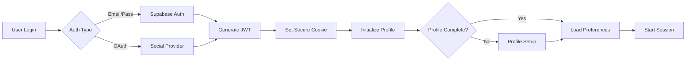

# アーキテクチャ仕様書 - WorldSpeakAI

## 🏗️ システム全体構成

```mermaid
graph TB
    subgraph "Client Layer"
        A[Web App] --> B[Expo Router v5]
        C[iOS/Android] --> B
        B --> D[React Components]
        D --> E[State Management<br/>(Context + Hooks)]
    end
    
    subgraph "Authentication & Profile"
        E --> F[Supabase Auth]
        F --> G[User Database]
        G --> H[Multi-language Profiles]
    end
    
    subgraph "AI Services Layer"
        E --> I[Web Speech API<br/>(Multi-language)]
        I --> J[Gemini AI Pro]
        J --> K[Script Generator]
        J --> L[Response Generator]
        L --> M[expo-speech<br/>(Multi-language TTS)]
    end
    
    subgraph "Data & Storage"
        E --> N[Supabase Realtime]
        N --> O[Conversation History]
        N --> P[Usage Tracking]
        N --> Q[Subscription Management]
    end
    
    subgraph "External Services"
        J --> R[Content Moderation API]
        E --> S[Analytics Service]
        E --> T[Error Tracking]
    end
```

## 💻 技術スタック詳細

### フロントエンド技術
| 技術 | バージョン | 用途 | 選定理由 |
|------|----------|------|----------|
| React Native | 0.79.3 | クロスプラットフォームUI | Web/iOS/Android統一開発 |
| Expo | 53.0.11 | 開発フレームワーク | 高速開発・OTA更新対応 |
| TypeScript | 5.8.3 | 型安全な開発 | 大規模開発での保守性 |
| Expo Router | 5.1.0 | ファイルベースルーティング | Next.js風の直感的構造 |

### バックエンド・AI技術
| 技術 | 用途 | 特徴 |
|------|------|------|
| Supabase | BaaS統合プラットフォーム | リアルタイム・RLS・Edge Functions |
| Gemini AI Pro | 多言語会話AI | 100+言語対応・専門分野理解 |
| Web Speech API | ブラウザ音声認識 | 低遅延・多言語対応 |
| expo-speech | ネイティブ音声合成 | 高品質TTS・言語別最適化 |

### 主要ライブラリ詳細
```json
{
  // AI・音声処理
  "@google/generative-ai": "^0.24.1",    // Gemini AI SDK
  "expo-speech": "~13.1.7",               // 音声合成
  
  // バックエンド統合
  "@supabase/supabase-js": "^2.50.0",    // Supabase Client
  "@supabase/realtime-js": "^2.10.7",    // リアルタイム同期
  
  // UI/UX
  "expo-linear-gradient": "^14.1.5",     // グラデーション
  "expo-blur": "~14.1.5",                // ブラー効果
  "expo-haptics": "~14.1.0",             // 触覚フィードバック
  "@shopify/react-native-skia": "^1.5.0", // 高性能グラフィックス
  
  // 状態管理・ユーティリティ
  "zustand": "^5.0.2",                   // 軽量状態管理
  "react-query": "^3.39.3",              // サーバー状態管理
  "date-fns": "^4.1.0",                  // 日付処理
  "zod": "^3.24.1"                       // スキーマバリデーション
}
```

### 開発ツール
| ツール | 用途 |
|--------|------|
| ESLint | コード品質管理 |
| Prettier | コードフォーマット |
| Jest | ユニットテスト |
| React Native Testing Library | コンポーネントテスト |
| Maestro | E2Eテスト自動化 |

## 📁 ディレクトリ構造

```
WorldSpeakAI/
├── app/                         # 画面コンポーネント（Expo Router）
│   ├── (tabs)/                 # タブナビゲーション
│   │   ├── index.tsx           # ホーム画面
│   │   ├── history.tsx         # 会話履歴
│   │   └── settings.tsx        # 設定画面
│   ├── auth/                   # 認証関連画面
│   │   ├── login.tsx          # ログイン画面
│   │   ├── signup.tsx         # 新規登録画面
│   │   └── reset-password.tsx # パスワードリセット
│   ├── conversation/           # 会話関連画面
│   │   ├── setup.tsx          # 会話設定画面
│   │   └── chat.tsx           # 会話実行画面
│   ├── history/               # 履歴詳細
│   │   └── [id].tsx           # 履歴詳細画面
│   ├── settings/              # 設定詳細
│   │   ├── profile.tsx        # プロフィール設定
│   │   └── subscription.tsx   # サブスクリプション管理
│   ├── feedback.tsx           # フィードバック画面
│   └── _layout.tsx            # ルートレイアウト
│
├── src/                        # ソースコード
│   ├── components/             # 再利用可能コンポーネント
│   │   ├── ui/                # 基本UIコンポーネント
│   │   │   ├── Button.tsx     # 汎用ボタン
│   │   │   ├── Card.tsx       # カード表示
│   │   │   ├── Input.tsx      # 入力フィールド
│   │   │   ├── Slider.tsx     # スライダー
│   │   │   ├── Switch.tsx     # ON/OFFスイッチ
│   │   │   └── ProgressBar.tsx # 進捗バー
│   │   ├── conversation/      # 会話関連コンポーネント
│   │   │   ├── MessageBubble.tsx    # メッセージ表示
│   │   │   ├── ScriptGuide.tsx      # 台本ガイド
│   │   │   ├── VoiceControls.tsx    # 音声制御UI
│   │   │   └── ConversationTimer.tsx # 会話タイマー
│   │   └── stats/             # 統計表示コンポーネント
│   │       ├── UsageChart.tsx # 使用量チャート
│   │       └── ProgressStats.tsx # 進捗統計
│   ├── contexts/              # React Context
│   │   ├── AuthContext.tsx    # 認証コンテキスト
│   │   ├── ConversationContext.tsx # 会話状態管理
│   │   └── SubscriptionContext.tsx # サブスクリプション管理
│   ├── hooks/                 # カスタムフック
│   │   ├── useConversation.ts # 会話ロジック
│   │   ├── useVoiceRecognition.ts # 音声認識
│   │   ├── useSpeechSynthesis.ts  # 音声合成
│   │   ├── useScriptGeneration.ts # 台本生成
│   │   └── useUsageTracking.ts    # 使用量追跡
│   ├── lib/                   # ライブラリ
│   │   ├── supabase.ts        # Supabase設定
│   │   ├── gemini.ts          # Gemini AI設定
│   │   └── speech.ts          # 音声API設定
│   ├── services/              # ビジネスロジック
│   │   ├── auth.service.ts         # 認証サービス
│   │   ├── conversation.service.ts # 会話管理
│   │   ├── script.service.ts       # 台本生成サービス
│   │   ├── multilingual.service.ts # 多言語対応
│   │   ├── subscription.service.ts # サブスクリプション
│   │   ├── usage.service.ts        # 使用量管理
│   │   └── ai.service.ts           # AI処理統合
│   └── types/                 # TypeScript型定義
│       ├── auth.types.ts      # 認証関連型
│       ├── conversation.types.ts # 会話関連型
│       ├── subscription.types.ts # サブスクリプション型
│       └── multilingual.types.ts # 多言語対応型
│
├── assets/                    # 静的アセット
│   ├── fonts/                # フォント
│   ├── images/               # 画像
│   └── audio/                # 音声ファイル
│
├── supabase/                 # Supabaseスキーマ
│   ├── migrations/           # マイグレーション
│   ├── functions/            # Edge Functions
│   └── seed.sql             # シードデータ
│
├── docs/                     # ドキュメント
│   └── ja/                   # 日本語ドキュメント
│
└── constants/                # 定数定義
    ├── Colors.ts            # カラーパレット
    ├── Languages.ts         # 対応言語定義
    └── Subscriptions.ts     # プラン定義
```

## 🔄 データフローアーキテクチャ

### 1. 多言語音声会話処理フロー

```mermaid
sequenceDiagram
    participant U as User
    participant UI as UI Layer
    participant WS as Web Speech API
    participant AI as Gemini AI
    participant TTS as expo-speech
    participant DB as Supabase
    
    U->>UI: マイクボタンタップ
    UI->>WS: startRecognition(language)
    WS->>UI: onResult(transcript)
    UI->>AI: generateResponse({
        text: transcript,
        context: conversation,
        language: pair,
        specialization: field
    })
    AI->>UI: response + script
    UI->>TTS: speak(response, language)
    UI->>DB: saveConversation()
    DB->>UI: confirmed
```

### 2. 台本生成アーキテクチャ

```typescript
interface ScriptGenerationFlow {
  // 1. 初期台本生成
  initializeScript(params: {
    scenario: ConversationScenario;
    languagePair: LanguagePair;
    userLevel: ProficiencyLevel;
    specialization?: string;
  }): Promise<ConversationScript>;
  
  // 2. 動的台本調整
  adjustScript(params: {
    currentScript: ConversationScript;
    userPerformance: PerformanceMetrics;
    conversationFlow: string[];
  }): Promise<ConversationScript>;
  
  // 3. 文化的配慮
  applyCulturalContext({
    script: ConversationScript;
    targetCulture: string;
    businessContext?: string;
  }): ConversationScript;
}
```

### 3. リアルタイム使用量追跡

```typescript
class UsageTrackingSystem {
  private microphoneTimer: MicTimer;
  private usageDB: SupabaseClient;
  
  // マイク時間の精密計測
  async trackMicrophoneUsage() {
    let activeTime = 0;
    let silenceTime = 0;
    
    this.microphoneTimer.on('voiceDetected', () => {
      activeTime += 100; // 100ms単位
    });
    
    this.microphoneTimer.on('silenceDetected', () => {
      silenceTime += 100;
      if (silenceTime > 2000) { // 2秒以上の無音
        this.pauseTracking();
      }
    });
    
    // リアルタイムDB更新
    await this.usageDB.rpc('increment_usage', {
      user_id: this.userId,
      mic_seconds: activeTime / 1000
    });
  }
}
```

### 4. 認証・セキュリティフロー



### 5. エラーハンドリング・リカバリーフロー

```typescript
interface ErrorRecoverySystem {
  // ネットワークエラー
  handleNetworkError(): {
    cacheLocally: boolean;
    retryStrategy: 'exponential' | 'linear';
    fallbackMode: 'offline' | 'degraded';
  };
  
  // AI処理エラー
  handleAIError(): {
    useCache: boolean;
    fallbackResponse: string;
    notifyUser: boolean;
  };
  
  // 音声認識エラー
  handleSpeechError(): {
    switchToTextInput: boolean;
    retryWithDifferentAPI: boolean;
  };
}
```

## 🔐 セキュリティアーキテクチャ

### 環境変数・シークレット管理
```typescript
// .env.local (開発環境)
EXPO_PUBLIC_SUPABASE_URL=https://xxx.supabase.co
EXPO_PUBLIC_SUPABASE_ANON_KEY=eyJhbG...

// .env.production (本番環境 - EAS Secrets)
GEMINI_API_KEY=AIza...  // サーバーサイドのみ
CONTENT_MODERATION_KEY=sk-...
SENTRY_DSN=https://...

// 実装例
class SecureConfigManager {
  private static instance: SecureConfigManager;
  
  getAPIKey(service: 'gemini' | 'moderation'): string {
    if (__DEV__) {
      return process.env[`${service.toUpperCase()}_API_KEY`];
    }
    // 本番環境ではEAS SecureStoreから取得
    return SecureStore.getItemAsync(`api_key_${service}`);
  }
}
```

### データベースセキュリティ実装

```sql
-- Row Level Security (RLS) ポリシー
-- ユーザーは自分のデータのみアクセス可能
CREATE POLICY "Users can only access own data"
ON conversations
FOR ALL
USING (auth.uid() = user_id);

-- 使用量データは読み取りのみ
CREATE POLICY "Usage data is read-only for users"
ON usage_tracking
FOR SELECT
USING (auth.uid() = user_id);

-- 会話履歴の暗号化
CREATE EXTENSION IF NOT EXISTS pgcrypto;

CREATE OR REPLACE FUNCTION encrypt_conversation()
RETURNS TRIGGER AS $$
BEGIN
  NEW.messages = pgp_sym_encrypt(
    NEW.messages::text,
    current_setting('app.encryption_key')
  )::jsonb;
  RETURN NEW;
END;
$$ LANGUAGE plpgsql;
```

### API通信セキュリティ

```typescript
class SecureAPIClient {
  private supabase: SupabaseClient;
  
  constructor() {
    this.supabase = createClient(
      process.env.EXPO_PUBLIC_SUPABASE_URL!,
      process.env.EXPO_PUBLIC_SUPABASE_ANON_KEY!,
      {
        auth: {
          persistSession: true,
          detectSessionInUrl: false,
          storage: SecureStore, // セキュアストレージ使用
        },
        global: {
          headers: {
            'X-Client-Version': Constants.manifest?.version || '1.0.0',
          },
        },
      }
    );
  }
  
  // APIレート制限実装
  @RateLimit({ requests: 100, window: '1m' })
  async callGeminiAI(prompt: string): Promise<AIResponse> {
    // リクエスト署名
    const signature = await this.generateRequestSignature(prompt);
    
    return fetch('/api/gemini', {
      method: 'POST',
      headers: {
        'X-Request-Signature': signature,
        'X-User-Token': await this.getUserToken(),
      },
      body: JSON.stringify({ prompt }),
    });
  }
}
```

### コンテンツセキュリティ

```typescript
interface ContentSecuritySystem {
  // 入力検証
  validateUserInput(text: string, language: string): {
    isValid: boolean;
    sanitized: string;
    warnings: string[];
  };
  
  // 出力フィルタリング  
  filterAIResponse(response: string, context: {
    targetAge: number;
    culturalSensitivity: string;
    businessContext: boolean;
  }): string;
  
  // 個人情報保護
  detectAndMaskPII(text: string): string;
}

## 🚀 パフォーマンス最適化戦略

### 1. 多言語リソース最適化

```typescript
// 言語パックの動的ローディング
class LanguageResourceManager {
  private loadedPacks = new Map<string, LanguagePackage>();
  
  async loadLanguagePack(language: string): Promise<void> {
    if (this.loadedPacks.has(language)) return;
    
    const pack = await import(`./locales/${language}/index`);
    this.loadedPacks.set(language, pack);
    
    // 音声リソースのプリロード
    await this.preloadVoiceAssets(language);
  }
  
  private async preloadVoiceAssets(language: string) {
    const commonPhrases = await import(`./audio/${language}/common`);
    // Web Audio APIでバッファリング
    commonPhrases.forEach(audio => {
      AudioCache.preload(audio.url);
    });
  }
}
```

### 2. AI応答キャッシング戦略

```typescript
class AIResponseCache {
  private cache: LRUCache<string, CachedResponse>;
  private similarityIndex: VectorDB;
  
  async getCachedOrGenerate(
    prompt: string,
    context: ConversationContext
  ): Promise<AIResponse> {
    // 類似プロンプト検索
    const cacheKey = this.generateCacheKey(prompt, context);
    const similar = await this.similarityIndex.search(prompt, 0.95);
    
    if (similar.length > 0) {
      // キャッシュヒット
      return this.adaptCachedResponse(similar[0], context);
    }
    
    // 新規生成
    const response = await this.generateNew(prompt, context);
    this.cache.set(cacheKey, response);
    await this.similarityIndex.add(prompt, response);
    
    return response;
  }
}
```

### 3. レンダリング最適化

```typescript
// 仮想化リストでの会話履歴表示
import { FlashList } from '@shopify/flash-list';

const ConversationHistory = memo(() => {
  const renderMessage = useCallback(({ item }) => (
    <MessageBubble 
      message={item}
      // 重い処理は遅延実行
      onVisible={() => loadMessageDetails(item.id)}
    />
  ), []);
  
  return (
    <FlashList
      data={messages}
      renderItem={renderMessage}
      estimatedItemSize={100}
      // スクロールパフォーマンス最適化
      drawDistance={200}
      removeClippedSubviews
    />
  );
});
```

### 4. バンドルサイズ最適化

```javascript
// metro.config.js
module.exports = {
  transformer: {
    minifierConfig: {
      keep_fnames: true,
      mangle: {
        keep_classnames: true,
      },
    },
  },
  resolver: {
    // 不要な言語リソースを除外
    blacklistRE: /(__tests__|e2e|\.(test|spec))\.(js|jsx|ts|tsx)$/,
  },
};

// 動的インポート例
const loadSpecializedFeature = async (feature: string) => {
  switch(feature) {
    case 'medical':
      return import('./features/medical/MedicalConversation');
    case 'business':
      return import('./features/business/BusinessConversation');
    default:
      return import('./features/general/GeneralConversation');
  }
};
```

### 5. メモリ管理

```typescript
class MemoryManager {
  private audioBuffers = new WeakMap();
  private imageCache = new Map();
  
  // 自動メモリ解放
  setupAutoCleanup() {
    // 5分ごとに未使用リソース解放
    setInterval(() => {
      this.cleanupUnusedResources();
    }, 5 * 60 * 1000);
    
    // メモリ警告時の対応
    AppState.addEventListener('memoryWarning', () => {
      this.emergencyCleanup();
    });
  }
  
  private cleanupUnusedResources() {
    // 30分以上アクセスされていないキャッシュを削除
    const threshold = Date.now() - 30 * 60 * 1000;
    
    this.imageCache.forEach((value, key) => {
      if (value.lastAccessed < threshold) {
        this.imageCache.delete(key);
      }
    });
  }
}
```

## 🌍 多言語対応アーキテクチャ

### 1. 言語処理コアシステム

```typescript
// 言語マネージャーの詳細実装
class MultilingualConversationManager {
  private languageConfig: LanguageConfiguration;
  private scriptEngine: ScriptGenerationEngine;
  private culturalAdapter: CulturalContextAdapter;
  
  async initializeConversation(params: {
    nativeLanguage: string;
    targetLanguage: string;
    proficiencyLevel: ProficiencyLevel;
    specialization?: string;
    culturalPreferences?: CulturalSettings;
  }): Promise<ConversationSession> {
    // 言語ペア最適化
    const optimizedPair = this.optimizeLanguagePair(
      params.nativeLanguage,
      params.targetLanguage
    );
    
    // 文化的コンテキスト適用
    const culturalContext = await this.culturalAdapter.prepare({
      languages: optimizedPair,
      businessContext: params.specialization,
      formalityLevel: params.culturalPreferences?.formality
    });
    
    // 初期台本生成
    const initialScript = await this.scriptEngine.generate({
      ...params,
      culturalContext
    });
    
    return new ConversationSession({
      languages: optimizedPair,
      script: initialScript,
      context: culturalContext
    });
  }
}

// 台本生成エンジン
interface ScriptGenerationEngine {
  generate(params: ScriptParams): Promise<MultilingualScript>;
  adapt(script: MultilingualScript, feedback: UserFeedback): Promise<MultilingualScript>;
  suggest(context: ConversationContext): Promise<ScriptSuggestion[]>;
}

// 文化的コンテキストアダプター
interface CulturalContextAdapter {
  prepare(settings: CulturalSettings): Promise<CulturalContext>;
  validateResponse(text: string, context: CulturalContext): ValidationResult;
  suggestAlternatives(phrase: string, context: CulturalContext): string[];
}
```

### 2. AI統合レイヤー

```typescript
class GeminiAIIntegration implements AIService {
  private gemini: GenerativeModel;
  private promptOptimizer: PromptOptimizer;
  private responseProcessor: ResponseProcessor;
  
  async generateResponse(params: {
    userInput: string;
    conversationHistory: Message[];
    languagePair: LanguagePair;
    specialization: string;
    scriptGuidance?: ScriptSuggestion;
  }): Promise<AIResponse> {
    // プロンプト最適化
    const optimizedPrompt = this.promptOptimizer.optimize({
      template: MULTILINGUAL_CONVERSATION_TEMPLATE,
      variables: {
        userInput: params.userInput,
        history: this.formatHistory(params.conversationHistory),
        nativeLanguage: params.languagePair.native,
        targetLanguage: params.languagePair.target,
        domain: params.specialization,
        scriptHint: params.scriptGuidance?.text
      }
    });
    
    // Gemini API呼び出し
    const rawResponse = await this.gemini.generateContent({
      contents: [{ 
        role: 'user', 
        parts: [{ text: optimizedPrompt }] 
      }],
      generationConfig: {
        temperature: 0.7,
        topK: 40,
        topP: 0.95,
        maxOutputTokens: 1024,
      },
      safetySettings: this.getSafetySettings(params.languagePair)
    });
    
    // レスポンス処理
    return this.responseProcessor.process({
      raw: rawResponse,
      context: params,
      validators: [
        new LanguageValidator(params.languagePair.target),
        new CulturalValidator(params.specialization),
        new ProficiencyValidator(params.userLevel)
      ]
    });
  }
}
```

### 3. 使用量管理システム

```typescript
class UsageManagementSystem {
  private trackers: Map<string, UsageTracker>;
  private limits: SubscriptionLimits;
  private alerts: AlertSystem;
  
  // リアルタイム使用量追跡
  async trackMicrophoneUsage(userId: string, sessionId: string) {
    const tracker = this.getOrCreateTracker(userId);
    
    // 音声アクティビティ検出
    const voiceDetector = new VoiceActivityDetector({
      threshold: 0.02,
      smoothing: 0.1
    });
    
    voiceDetector.on('voiceStart', async () => {
      tracker.startCounting();
      await this.updateRealtimeUsage(userId, 'start');
    });
    
    voiceDetector.on('voiceEnd', async () => {
      const duration = tracker.stopCounting();
      await this.updateRealtimeUsage(userId, 'increment', duration);
      
      // 制限チェック
      if (await this.checkLimits(userId)) {
        this.alerts.notify(userId, 'APPROACHING_LIMIT');
      }
    });
  }
  
  // サブスクリプション管理
  getSubscriptionDetails(plan: SubscriptionPlan): PlanDetails {
    return {
      FREE: {
        microphoneMinutes: 60,
        languageLimit: 5,
        features: ['basic_script', 'basic_feedback'],
        price: 0
      },
      STANDARD: {
        microphoneMinutes: 900, // 15時間
        languageLimit: -1, // 無制限
        features: ['all_scripts', 'detailed_feedback', 'history'],
        price: 6.9
      },
      PREMIUM: {
        microphoneMinutes: 3000, // 50時間
        languageLimit: -1,
        features: ['all_standard', 'ai_coaching', 'analytics', 'priority_support'],
        price: 19.9
      }
    }[plan];
  }
}
```

### 4. エラー処理・フォールバック

```typescript
class RobustConversationHandler {
  async handleConversation(input: ConversationInput): Promise<ConversationOutput> {
    try {
      return await this.processNormally(input);
    } catch (error) {
      return await this.handleWithFallback(error, input);
    }
  }
  
  private async handleWithFallback(
    error: Error,
    input: ConversationInput
  ): Promise<ConversationOutput> {
    if (error instanceof NetworkError) {
      // オフラインモード
      return this.offlineConversation(input);
    }
    
    if (error instanceof AIServiceError) {
      // 代替AI使用
      return this.fallbackAI(input);
    }
    
    if (error instanceof SpeechRecognitionError) {
      // テキスト入力に切り替え
      return this.textOnlyMode(input);
    }
    
    // 最終フォールバック
    return this.basicScriptMode(input);
  }
}
```

## 📊 実装優先順位ガイド

### Phase 1: MVP (1-2ヶ月)
1. 基本的な音声会話機能（5言語）
2. シンプルな台本機能
3. ユーザー認証・プロフィール
4. 使用量追跡（マイク時間）

### Phase 2: 拡張機能 (3-4ヶ月)
1. 全言語対応（100+）
2. 高度な台本生成
3. 専門分野対応
4. 詳細なフィードバック

### Phase 3: 最適化 (5-6ヶ月)
1. パフォーマンス最適化
2. オフライン対応
3. AIコーチング機能
4. 高度な分析機能