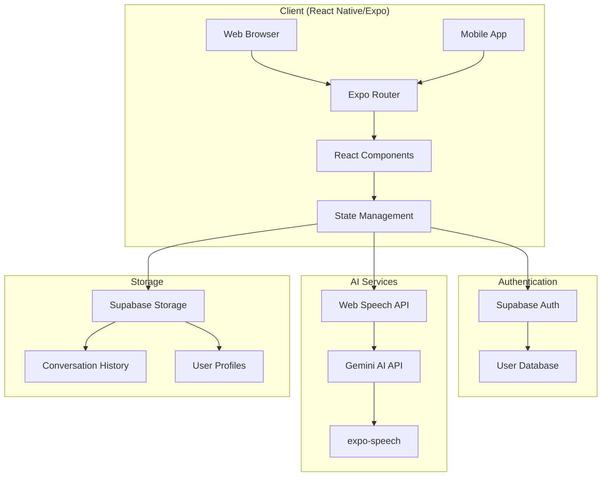

# アーキテクチャ

## 🏗️ システム構成



## 💻 技術スタック

### フロントエンド
| 技術 | バージョン | 用途 |
|------|----------|------|
| React Native | 0.79.3 | クロスプラットフォームUI |
| Expo | 53.0.11 | 開発フレームワーク |
| TypeScript | 5.8.3 | 型安全な開発 |
| Expo Router | 5.1.0 | ナビゲーション |

### バックエンド・サービス
| 技術 | 用途 |
|------|------|
| Supabase | 認証、データベース、ストレージ |
| Google Gemini AI | AI会話生成 |
| Web Speech API | 音声認識 |

### 主要ライブラリ
```json
{
  "@google/generative-ai": "^0.24.1",
  "@supabase/supabase-js": "^2.50.0",
  "expo-speech": "~13.1.7",
  "expo-linear-gradient": "^14.1.5",
  "expo-blur": "~14.1.5"
}
```

## 📁 ディレクトリ構造

```
WorldSpeakAI/
├── app/                      # 画面コンポーネント
│   ├── (tabs)/              # タブナビゲーション
│   │   ├── index.tsx        # ホーム画面
│   │   └── explore.tsx      # 探索画面
│   ├── auth.tsx             # 認証画面
│   ├── conversation.tsx     # AI会話画面
│   ├── feedback.tsx         # フィードバック画面
│   ├── profile.tsx          # プロフィール画面
│   ├── settings.tsx         # 設定画面
│   └── _layout.tsx          # ルートレイアウト
│
├── src/                     # ソースコード
│   ├── components/          # 再利用可能コンポーネント
│   ├── contexts/            # React Context
│   │   └── AuthContext.tsx  # 認証コンテキスト
│   ├── hooks/               # カスタムフック
│   │   └── useConversation.ts
│   ├── lib/                 # ライブラリ
│   │   ├── supabase.ts      # Supabase設定
│   │   └── gemini.js        # Gemini AI設定
│   └── services/            # ビジネスロジック
│       ├── auth.service.ts
│       ├── conversation.service.ts
│       ├── profile.service.ts
│       ├── subscription.service.ts
│       └── translation.service.ts
│
├── assets/                  # 静的アセット
│   ├── fonts/              # フォント
│   └── images/             # 画像
│
├── supabase/               # Supabaseスキーマ
│   ├── migrations/         # マイグレーション
│   ├── functions/          # Edge Functions
│   └── seed.sql           # シードデータ
│
├── docs/                   # ドキュメント
│   └── ja/                 # 日本語ドキュメント
│
└── constants/              # 定数定義
    └── Colors.ts

```

## 🔄 データフロー

### 音声会話のフロー
1. **音声入力**
   - ユーザーがマイクボタンをタップ
   - Web Speech APIが音声を認識
   - テキストに変換

2. **AI処理**
   - テキストをGemini AIに送信
   - コンテキストを考慮した応答生成
   - 応答テキストを受信

3. **音声出力**
   - expo-speechで音声合成
   - 自然な英語で応答を再生

### 認証フロー
1. **サインアップ/ログイン**
   - メールアドレスとパスワードで認証
   - Supabase Authがトークン発行
   - セッション管理

2. **認証状態管理**
   - AuthContextで全体管理
   - 自動ログイン機能
   - セキュアなトークン保存

## 🔐 セキュリティ設計

### APIキー管理
```javascript
// 環境変数での管理
EXPO_PUBLIC_SUPABASE_URL=your_supabase_url
EXPO_PUBLIC_SUPABASE_ANON_KEY=your_anon_key
GEMINI_API_KEY=your_gemini_key
```

### データベースセキュリティ
- Row Level Security (RLS) 有効化
- ユーザーごとのデータ分離
- 最小権限の原則

### 通信セキュリティ
- HTTPS必須
- JWTトークンによる認証
- CORSポリシー設定

## 🚀 パフォーマンス最適化

### コード分割
- 動的インポート使用
- 遅延ローディング
- バンドルサイズ最適化

### キャッシング戦略
- 会話履歴のローカルキャッシュ
- APIレスポンスキャッシュ
- 画像アセット最適化

### 状態管理
- 最小限の再レンダリング
- メモ化の活用
- 効率的なデータ構造