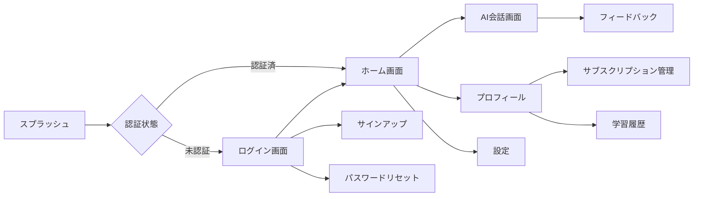

# 画面仕様

## 📱 画面遷移図



## 🖼️ 画面詳細

### 1. ログイン画面 (`/auth`)

**概要**
- ユーザー認証のエントリーポイント
- メール/パスワードでのログイン
- 新規登録へのナビゲーション

**UI要素**
```typescript
- メールアドレス入力フィールド
- パスワード入力フィールド
- ログインボタン
- サインアップリンク
- パスワードリセットリンク
- ソーシャルログイン（将来実装）
```

**デザイン仕様**
- グラデーション背景（#4facfe → #00f2fe）
- 角丸のフォーム要素
- エラーメッセージ表示エリア

### 2. ホーム画面 (`/`)

**概要**
- アプリのメインハブ
- 主要機能へのクイックアクセス
- 学習進捗の表示

**UI要素**
```typescript
- ウェルカムメッセージ
- 「会話を始める」ボタン（大）
- 今日の学習時間
- 連続学習日数
- クイックアクセスメニュー
```

### 3. AI会話画面 (`/conversation`)

**概要**
- メイン機能画面
- リアルタイム音声会話
- チャット形式の表示

**UI要素**
```typescript
interface ConversationScreen {
  header: {
    backButton: TouchableOpacity;
    title: "AI英会話";
    endButton: TouchableOpacity;
  };
  
  chatArea: {
    messages: Message[];
    scrollView: ScrollView;
  };
  
  scriptGuide: {
    template: string;
    hints: string;
    collapsible: boolean;
  };
  
  controls: {
    microphoneButton: AnimatedButton;
    recordingIndicator: PulseAnimation;
    recognizedText: Text;
  };
}
```

**状態管理**
- 録音中/停止中
- 処理中（AI応答待ち）
- エラー状態

**アニメーション**
- マイクボタンのパルスアニメーション
- メッセージの出現アニメーション
- スクロールアニメーション

### 4. プロフィール画面 (`/profile`)

**概要**
- ユーザー情報の表示・編集
- 学習統計
- サブスクリプション管理

**セクション構成**
1. **基本情報**
   - アバター画像
   - ユーザー名
   - メールアドレス
   - 学習レベル

2. **学習統計**
   - 総会話時間
   - 総会話回数
   - お気に入りトピック
   - 進捗グラフ

3. **サブスクリプション**
   - 現在のプラン
   - 使用状況
   - アップグレードボタン

### 5. 設定画面 (`/settings`)

**概要**
- アプリケーション設定
- 通知設定
- アカウント管理

**設定項目**
```typescript
interface SettingsOptions {
  general: {
    language: "日本語" | "English";
    theme: "Light" | "Dark" | "Auto";
    fontSize: "Small" | "Medium" | "Large";
  };
  
  audio: {
    voiceSpeed: number; // 0.5 - 2.0
    voicePitch: number; // 0.5 - 2.0
    inputSensitivity: "Low" | "Medium" | "High";
  };
  
  notifications: {
    dailyReminder: boolean;
    achievementAlerts: boolean;
    marketingEmails: boolean;
  };
  
  account: {
    changePassword: () => void;
    deleteAccount: () => void;
    logout: () => void;
  };
}
```

### 6. フィードバック画面 (`/feedback`)

**概要**
- 会話セッション終了後の評価
- 学習ポイントの確認
- 次回への改善提案

**表示内容**
- セッション時間
- 話した単語数
- AI評価スコア
- 改善ポイント
- 「もう一度」ボタン
- 「ホームへ」ボタン

## 🎨 UIコンポーネント

### 共通コンポーネント

**1. GradientButton**
```typescript
interface GradientButtonProps {
  title: string;
  onPress: () => void;
  colors?: string[];
  disabled?: boolean;
  loading?: boolean;
}
```

**2. MessageBubble**
```typescript
interface MessageBubbleProps {
  message: string;
  isAI: boolean;
  timestamp: Date;
  avatar?: string;
}
```

**3. LoadingOverlay**
```typescript
interface LoadingOverlayProps {
  visible: boolean;
  text?: string;
  opacity?: number;
}
```

### デザインシステム

**カラーパレット**
```typescript
const colors = {
  primary: '#4facfe',
  secondary: '#00f2fe',
  success: '#4CAF50',
  warning: '#FF9800',
  error: '#F44336',
  text: {
    primary: '#212121',
    secondary: '#757575',
    inverse: '#FFFFFF'
  },
  background: {
    primary: '#FFFFFF',
    secondary: '#F5F5F5',
    overlay: 'rgba(0, 0, 0, 0.5)'
  }
};
```

**タイポグラフィ**
```typescript
const typography = {
  heading1: {
    fontSize: 28,
    fontWeight: '700',
    lineHeight: 34
  },
  heading2: {
    fontSize: 22,
    fontWeight: '600',
    lineHeight: 28
  },
  body: {
    fontSize: 16,
    fontWeight: '400',
    lineHeight: 22
  },
  caption: {
    fontSize: 14,
    fontWeight: '400',
    lineHeight: 20
  }
};
```

**スペーシング**
```typescript
const spacing = {
  xs: 4,
  sm: 8,
  md: 16,
  lg: 24,
  xl: 32,
  xxl: 48
};
```