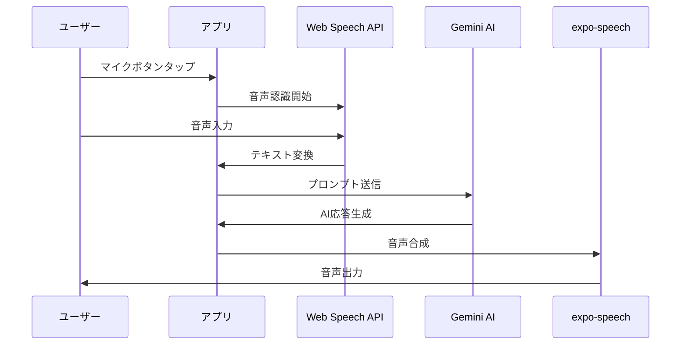

# 機能仕様

## 🔐 認証機能

### 概要
Supabase Authを使用した安全なユーザー認証システム

### 機能詳細

#### 1. ユーザー登録
```typescript
interface SignUpData {
  email: string;
  password: string;
  fullName?: string;
}

// 実装例
const signUp = async (data: SignUpData) => {
  const { data: authData, error } = await supabase.auth.signUp({
    email: data.email,
    password: data.password,
    options: {
      data: {
        full_name: data.fullName
      }
    }
  });
};
```

**バリデーション**
- メール形式チェック
- パスワード強度（8文字以上、英数字混在）
- 既存ユーザーチェック

#### 2. ログイン/ログアウト
- メール/パスワード認証
- セッション管理（自動更新）
- Remember Me機能
- セキュアなログアウト処理

#### 3. パスワードリセット
- メールによるリセットリンク送信
- セキュアトークン管理
- 有効期限設定（24時間）

## 🎤 AI会話機能

### 概要
Web Speech API + Gemini AI + expo-speechを組み合わせた自然な音声会話

### 処理フロー



### 主要機能

#### 1. 音声認識
```javascript
const startRecording = async () => {
  const SpeechRecognition = window.SpeechRecognition || window.webkitSpeechRecognition;
  const recognition = new SpeechRecognition();
  
  recognition.lang = 'en-US';
  recognition.continuous = false;
  recognition.interimResults = false;
  recognition.maxAlternatives = 1;
  
  recognition.onresult = (event) => {
    const transcript = event.results[0][0].transcript;
    processUserMessage(transcript);
  };
  
  recognition.start();
};
```

**対応ブラウザ**
- Chrome 25+
- Safari 14.1+
- Edge 79+

#### 2. AI応答生成
```javascript
const processUserMessage = async (text) => {
  const prompt = `
    Please respond naturally to this message in a conversational way, 
    as if you're having a friendly chat. Keep your response concise and engaging.
    
    User said: "${text}"
    
    Please respond:
  `;
  
  const response = await sendMessageToGemini(prompt);
  return response;
};
```

**Gemini設定**
- モデル: gemini-1.5-flash
- 温度: 0.7（自然な応答）
- トークン制限: 150（簡潔な応答）

#### 3. 音声合成
```javascript
Speech.speak(geminiResponse, {
  language: 'en',
  pitch: 1.0,
  rate: 0.9,
  voice: 'en-US-Standard-C' // 女性の声
});
```

### エラーハンドリング

| エラータイプ | 対処法 |
|------------|--------|
| マイク権限拒否 | 権限要求ダイアログ表示 |
| ネットワークエラー | リトライ機能 |
| API制限超過 | 待機メッセージ表示 |
| 音声認識失敗 | 再録音促進 |

## 👤 プロフィール管理

### データ構造
```typescript
interface UserProfile {
  id: string;
  email: string;
  full_name: string;
  avatar_url?: string;
  level: 'beginner' | 'intermediate' | 'advanced';
  native_language: string;
  learning_goals: string[];
  created_at: Date;
  updated_at: Date;
}
```

### 機能一覧
1. **基本情報編集**
   - 名前変更
   - アバター画像アップロード
   - 学習レベル設定

2. **学習設定**
   - 目標設定
   - 興味のあるトピック選択
   - 学習リマインダー設定

3. **統計情報**
   - 総学習時間
   - 会話回数
   - 達成バッジ

## 💳 サブスクリプション管理

### プラン構成

| プラン | 料金 | 機能 |
|--------|------|------|
| Free | ¥0/月 | • 1日10回の会話<br>• 基本機能のみ |
| Standard | ¥980/月 | • 無制限会話<br>• 会話履歴保存<br>• 基本分析 |
| Premium | ¥1,980/月 | • 全Standard機能<br>• 詳細分析<br>• カスタムシナリオ<br>• 優先サポート |

### 実装
```typescript
interface Subscription {
  id: string;
  user_id: string;
  plan_type: 'free' | 'standard' | 'premium';
  status: 'active' | 'canceled' | 'past_due';
  current_period_start: Date;
  current_period_end: Date;
  cancel_at_period_end: boolean;
}
```

### 使用量追跡
```typescript
interface UsageTracking {
  user_id: string;
  date: Date;
  conversations_count: number;
  total_duration: number; // 秒
  words_spoken: number;
  ai_responses: number;
}
```

## 📊 分析機能

### 学習分析
1. **会話分析**
   - 使用語彙数
   - 文法正確性
   - 流暢性スコア

2. **進捗追跡**
   - 日別/週別/月別統計
   - 目標達成率
   - 改善トレンド

3. **レポート生成**
   - 月次レポート
   - 強み/弱み分析
   - 学習推奨事項

### ダッシュボード表示
```typescript
interface LearningDashboard {
  summary: {
    totalHours: number;
    conversationsToday: number;
    currentStreak: number;
    overallProgress: number; // パーセンテージ
  };
  
  recentActivity: ConversationSummary[];
  
  achievements: Achievement[];
  
  recommendations: string[];
}
```