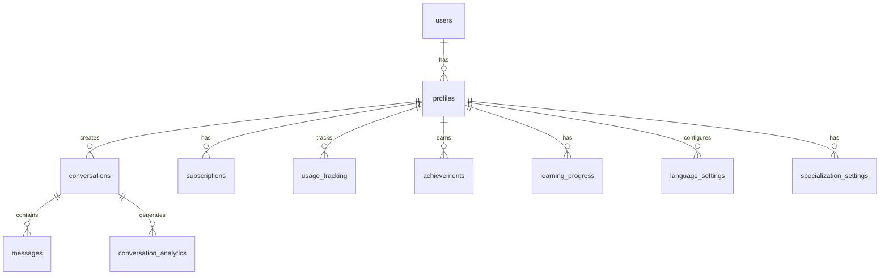

# データベース設計書 - WorldSpeakAI

## 🗄️ データベース概要

### 技術スタック
- **データベース**: PostgreSQL 15+ (Supabase)
- **認証**: Supabase Auth (JWT)
- **ストレージ**: Supabase Storage (音声ファイル、アバター)
- **リアルタイム**: Supabase Realtime (会話同期)
- **キャッシュ**: Redis (将来実装)

### 設計原則
1. **多言語対応**: すべてのテキストフィールドでUTF-8完全サポート
2. **スケーラビリティ**: パーティショニング、インデックス最適化
3. **セキュリティ**: RLS、暗号化、監査ログ
4. **パフォーマンス**: 適切なインデックス、マテリアライズドビュー

## 📊 ER図



## 🏗️ テーブル構造

### 1. profiles テーブル（拡張版）
多言語学習者の詳細プロフィール

```sql
CREATE TABLE profiles (
  -- 基本情報
  id UUID PRIMARY KEY REFERENCES auth.users(id) ON DELETE CASCADE,
  email TEXT UNIQUE NOT NULL,
  full_name TEXT NOT NULL,
  avatar_url TEXT,
  
  -- 言語設定
  native_language TEXT NOT NULL,
  target_languages TEXT[] NOT NULL DEFAULT '{}',
  current_language_pair JSONB, -- {native: 'ja', target: 'en'}
  
  -- 学習レベル
  proficiency_levels JSONB DEFAULT '{}', -- {en: 'intermediate', zh: 'beginner'}
  
  -- プロフィール詳細
  timezone TEXT DEFAULT 'UTC',
  preferred_learning_time JSONB, -- {start: '09:00', end: '10:00'}
  learning_style TEXT CHECK (learning_style IN ('visual', 'auditory', 'kinesthetic')),
  
  -- メタデータ
  created_at TIMESTAMPTZ DEFAULT NOW(),
  updated_at TIMESTAMPTZ DEFAULT NOW(),
  last_active_at TIMESTAMPTZ DEFAULT NOW(),
  is_active BOOLEAN DEFAULT TRUE,
  
  -- 設定
  preferences JSONB DEFAULT '{
    "notifications": true,
    "email_updates": true,
    "show_pronunciation_guide": true,
    "auto_play_responses": true
  }'::jsonb
);

-- インデックス
CREATE INDEX idx_profiles_email ON profiles(email);
CREATE INDEX idx_profiles_native_language ON profiles(native_language);
CREATE INDEX idx_profiles_target_languages ON profiles USING GIN(target_languages);
CREATE INDEX idx_profiles_last_active ON profiles(last_active_at DESC);
```

### 2. language_settings テーブル（新規）
言語別の詳細設定

```sql
CREATE TABLE language_settings (
  id UUID PRIMARY KEY DEFAULT uuid_generate_v4(),
  user_id UUID NOT NULL REFERENCES profiles(id) ON DELETE CASCADE,
  language_code TEXT NOT NULL,
  
  -- 学習設定
  proficiency_level TEXT NOT NULL CHECK (proficiency_level IN ('beginner', 'elementary', 'intermediate', 'advanced', 'native')),
  learning_goals TEXT[],
  daily_target_minutes INTEGER DEFAULT 30,
  
  -- 音声設定
  preferred_voice_id TEXT,
  speech_rate DECIMAL(2,1) DEFAULT 1.0 CHECK (speech_rate BETWEEN 0.5 AND 2.0),
  
  -- 統計
  total_learning_minutes INTEGER DEFAULT 0,
  total_conversations INTEGER DEFAULT 0,
  vocabulary_mastered INTEGER DEFAULT 0,
  
  created_at TIMESTAMPTZ DEFAULT NOW(),
  updated_at TIMESTAMPTZ DEFAULT NOW(),
  
  UNIQUE(user_id, language_code)
);

CREATE INDEX idx_language_settings_user_language ON language_settings(user_id, language_code);
```

### 3. conversations テーブル（拡張版）
多言語会話セッション管理

```sql
CREATE TABLE conversations (
  id UUID PRIMARY KEY DEFAULT uuid_generate_v4(),
  user_id UUID NOT NULL REFERENCES profiles(id) ON DELETE CASCADE,
  
  -- 会話設定
  title TEXT,
  language_pair JSONB NOT NULL, -- {native: 'ja', target: 'en'}
  scenario TEXT NOT NULL,
  specialization TEXT,
  difficulty_level INTEGER CHECK (difficulty_level BETWEEN 1 AND 10),
  
  -- 台本情報
  script_id UUID,
  script_enabled BOOLEAN DEFAULT TRUE,
  script_adherence_score DECIMAL(3,2), -- 台本への準拠度
  
  -- タイミング
  started_at TIMESTAMPTZ DEFAULT NOW(),
  ended_at TIMESTAMPTZ,
  duration_seconds INTEGER,
  actual_speaking_time INTEGER, -- 実際の発話時間
  
  -- 統計
  message_count INTEGER DEFAULT 0,
  user_message_count INTEGER DEFAULT 0,
  ai_message_count INTEGER DEFAULT 0,
  words_spoken INTEGER DEFAULT 0,
  unique_words_used INTEGER DEFAULT 0,
  
  -- 評価
  fluency_score DECIMAL(3,2),
  accuracy_score DECIMAL(3,2),
  pronunciation_score DECIMAL(3,2),
  overall_score DECIMAL(3,2),
  
  -- メタデータ
  created_at TIMESTAMPTZ DEFAULT NOW(),
  metadata JSONB DEFAULT '{}'::jsonb
);

-- インデックス
CREATE INDEX idx_conversations_user_id ON conversations(user_id);
CREATE INDEX idx_conversations_language_pair ON conversations USING GIN(language_pair);
CREATE INDEX idx_conversations_created_at ON conversations(created_at DESC);
CREATE INDEX idx_conversations_scenario ON conversations(scenario);
CREATE INDEX idx_conversations_ended_at ON conversations(ended_at) WHERE ended_at IS NOT NULL;
```

### 4. messages テーブル（拡張版）
多言語メッセージ詳細

```sql
CREATE TABLE messages (
  id UUID PRIMARY KEY DEFAULT uuid_generate_v4(),
  conversation_id UUID NOT NULL REFERENCES conversations(id) ON DELETE CASCADE,
  user_id UUID NOT NULL REFERENCES profiles(id) ON DELETE CASCADE,
  
  -- メッセージ内容
  content TEXT NOT NULL,
  language TEXT NOT NULL,
  translated_content JSONB, -- {ja: '...', en: '...'}
  
  -- メッセージタイプ
  is_ai BOOLEAN DEFAULT FALSE,
  message_type TEXT CHECK (message_type IN ('user_speech', 'ai_response', 'script_suggestion', 'system')),
  
  -- 音声データ
  audio_url TEXT,
  audio_duration_ms INTEGER,
  
  -- 分析データ
  pronunciation_analysis JSONB, -- 発音分析結果
  grammar_corrections JSONB,    -- 文法修正提案
  vocabulary_highlights JSONB,  -- 重要語彙
  
  -- タイムスタンプ
  created_at TIMESTAMPTZ DEFAULT NOW(),
  
  -- メタデータ
  metadata JSONB DEFAULT '{}'::jsonb
);

-- インデックス
CREATE INDEX idx_messages_conversation_id ON messages(conversation_id);
CREATE INDEX idx_messages_created_at ON messages(created_at);
CREATE INDEX idx_messages_user_language ON messages(user_id, language);
CREATE INDEX idx_messages_type ON messages(message_type);
```

### 5. conversation_scripts テーブル（新規）
台本管理

```sql
CREATE TABLE conversation_scripts (
  id UUID PRIMARY KEY DEFAULT uuid_generate_v4(),
  
  -- 基本情報
  title TEXT NOT NULL,
  description TEXT,
  language_pair JSONB NOT NULL,
  scenario TEXT NOT NULL,
  difficulty_level INTEGER CHECK (difficulty_level BETWEEN 1 AND 10),
  estimated_duration_minutes INTEGER,
  
  -- 台本内容
  script_segments JSONB NOT NULL, -- [{order: 1, speaker: 'user', text: '...', alternatives: []}]
  cultural_notes JSONB,
  vocabulary_focus JSONB,
  
  -- カテゴリ
  category TEXT NOT NULL,
  tags TEXT[],
  specialization TEXT,
  
  -- 使用統計
  usage_count INTEGER DEFAULT 0,
  average_rating DECIMAL(2,1),
  completion_rate DECIMAL(3,2),
  
  -- メタデータ
  created_at TIMESTAMPTZ DEFAULT NOW(),
  updated_at TIMESTAMPTZ DEFAULT NOW(),
  created_by UUID REFERENCES profiles(id),
  is_premium BOOLEAN DEFAULT FALSE
);

-- インデックス
CREATE INDEX idx_scripts_language_pair ON conversation_scripts USING GIN(language_pair);
CREATE INDEX idx_scripts_scenario ON conversation_scripts(scenario);
CREATE INDEX idx_scripts_category ON conversation_scripts(category);
CREATE INDEX idx_scripts_tags ON conversation_scripts USING GIN(tags);
```

### 6. subscriptions テーブル（拡張版）
サブスクリプション管理

```sql
CREATE TABLE subscriptions (
  id UUID PRIMARY KEY DEFAULT uuid_generate_v4(),
  user_id UUID NOT NULL REFERENCES profiles(id) ON DELETE CASCADE,
  
  -- プラン情報
  plan_type TEXT NOT NULL DEFAULT 'free' CHECK (plan_type IN ('free', 'standard', 'premium', 'enterprise')),
  status TEXT NOT NULL DEFAULT 'active' CHECK (status IN ('active', 'canceled', 'past_due', 'paused')),
  
  -- 期間管理
  current_period_start TIMESTAMPTZ NOT NULL DEFAULT NOW(),
  current_period_end TIMESTAMPTZ NOT NULL DEFAULT (NOW() + INTERVAL '30 days'),
  trial_end TIMESTAMPTZ,
  cancel_at_period_end BOOLEAN DEFAULT FALSE,
  canceled_at TIMESTAMPTZ,
  
  -- 使用量制限
  monthly_minutes_limit INTEGER NOT NULL DEFAULT 60, -- Free: 60, Standard: 900, Premium: 3000
  monthly_minutes_used INTEGER DEFAULT 0,
  reset_date DATE NOT NULL DEFAULT (DATE_TRUNC('month', NOW()) + INTERVAL '1 month')::DATE,
  
  -- 支払い情報
  stripe_customer_id TEXT,
  stripe_subscription_id TEXT,
  payment_method_id TEXT,
  
  -- 価格情報
  monthly_price_cents INTEGER,
  currency TEXT DEFAULT 'USD',
  
  -- メタデータ
  created_at TIMESTAMPTZ DEFAULT NOW(),
  updated_at TIMESTAMPTZ DEFAULT NOW(),
  metadata JSONB DEFAULT '{}'::jsonb
);

-- インデックス
CREATE UNIQUE INDEX idx_subscriptions_user_id ON subscriptions(user_id);
CREATE INDEX idx_subscriptions_status ON subscriptions(status);
CREATE INDEX idx_subscriptions_reset_date ON subscriptions(reset_date);
CREATE INDEX idx_subscriptions_stripe_customer ON subscriptions(stripe_customer_id) WHERE stripe_customer_id IS NOT NULL;
```

### 7. usage_tracking テーブル（拡張版）
詳細な使用量追跡

```sql
CREATE TABLE usage_tracking (
  id UUID PRIMARY KEY DEFAULT uuid_generate_v4(),
  user_id UUID NOT NULL REFERENCES profiles(id) ON DELETE CASCADE,
  
  -- 時間情報
  tracked_at TIMESTAMPTZ NOT NULL DEFAULT NOW(),
  date DATE NOT NULL DEFAULT CURRENT_DATE,
  hour INTEGER NOT NULL DEFAULT EXTRACT(HOUR FROM NOW()),
  
  -- 使用量詳細
  microphone_seconds INTEGER NOT NULL DEFAULT 0,
  conversation_count INTEGER DEFAULT 0,
  message_count INTEGER DEFAULT 0,
  
  -- 言語別統計
  language_breakdown JSONB DEFAULT '{}'::jsonb, -- {en: 300, ja: 150}
  
  -- 機能別使用量
  feature_usage JSONB DEFAULT '{}'::jsonb, -- {script_generation: 5, pronunciation_check: 10}
  
  -- 集計用
  is_aggregated BOOLEAN DEFAULT FALSE,
  
  UNIQUE(user_id, date, hour)
);

-- インデックス
CREATE INDEX idx_usage_tracking_user_date ON usage_tracking(user_id, date DESC);
CREATE INDEX idx_usage_tracking_aggregation ON usage_tracking(is_aggregated, date) WHERE NOT is_aggregated;
```

### 8. learning_progress テーブル（新規）
学習進捗管理

```sql
CREATE TABLE learning_progress (
  id UUID PRIMARY KEY DEFAULT uuid_generate_v4(),
  user_id UUID NOT NULL REFERENCES profiles(id) ON DELETE CASCADE,
  language_code TEXT NOT NULL,
  
  -- スキル評価
  speaking_level DECIMAL(3,2) DEFAULT 0.0,
  listening_level DECIMAL(3,2) DEFAULT 0.0,
  vocabulary_size INTEGER DEFAULT 0,
  grammar_accuracy DECIMAL(3,2) DEFAULT 0.0,
  pronunciation_accuracy DECIMAL(3,2) DEFAULT 0.0,
  fluency_score DECIMAL(3,2) DEFAULT 0.0,
  
  -- 学習統計
  total_study_time_minutes INTEGER DEFAULT 0,
  consecutive_days INTEGER DEFAULT 0,
  last_study_date DATE,
  
  -- 目標達成
  weekly_goal_minutes INTEGER DEFAULT 210, -- 30分 x 7日
  weekly_achieved_minutes INTEGER DEFAULT 0,
  
  -- トピック別進捗
  topic_mastery JSONB DEFAULT '{}'::jsonb, -- {business: 0.7, travel: 0.5}
  
  -- 更新情報
  created_at TIMESTAMPTZ DEFAULT NOW(),
  updated_at TIMESTAMPTZ DEFAULT NOW(),
  
  UNIQUE(user_id, language_code)
);

-- インデックス
CREATE INDEX idx_learning_progress_user_language ON learning_progress(user_id, language_code);
CREATE INDEX idx_learning_progress_streak ON learning_progress(consecutive_days DESC);
```

### 9. achievements テーブル（拡張版）
実績・バッジシステム

```sql
CREATE TABLE achievements (
  id UUID PRIMARY KEY DEFAULT uuid_generate_v4(),
  user_id UUID NOT NULL REFERENCES profiles(id) ON DELETE CASCADE,
  
  -- 実績情報
  achievement_type TEXT NOT NULL,
  achievement_code TEXT NOT NULL,
  name JSONB NOT NULL, -- {en: 'First Conversation', ja: '初めての会話'}
  description JSONB NOT NULL,
  icon_url TEXT,
  
  -- 達成条件
  criteria JSONB NOT NULL,
  progress DECIMAL(5,2) DEFAULT 0.0,
  
  -- ステータス
  earned_at TIMESTAMPTZ,
  is_earned BOOLEAN DEFAULT FALSE,
  
  -- 報酬
  reward_type TEXT,
  reward_value INTEGER,
  
  -- カテゴリ
  category TEXT NOT NULL,
  tier TEXT CHECK (tier IN ('bronze', 'silver', 'gold', 'platinum')),
  display_order INTEGER,
  
  created_at TIMESTAMPTZ DEFAULT NOW(),
  
  UNIQUE(user_id, achievement_code)
);

-- インデックス
CREATE INDEX idx_achievements_user_earned ON achievements(user_id, is_earned);
CREATE INDEX idx_achievements_category ON achievements(category);
```

## 🔒 セキュリティ設計

### Row Level Security (RLS) ポリシー

```sql
-- すべてのテーブルでRLSを有効化
ALTER TABLE profiles ENABLE ROW LEVEL SECURITY;
ALTER TABLE conversations ENABLE ROW LEVEL SECURITY;
ALTER TABLE messages ENABLE ROW LEVEL SECURITY;
ALTER TABLE subscriptions ENABLE ROW LEVEL SECURITY;
ALTER TABLE usage_tracking ENABLE ROW LEVEL SECURITY;
ALTER TABLE learning_progress ENABLE ROW LEVEL SECURITY;
ALTER TABLE achievements ENABLE ROW LEVEL SECURITY;

-- profiles: ユーザーは自分のプロフィールのみアクセス可能
CREATE POLICY "Users can CRUD own profile" ON profiles
  FOR ALL USING (auth.uid() = id);

-- conversations: ユーザーは自分の会話のみアクセス可能
CREATE POLICY "Users can CRUD own conversations" ON conversations
  FOR ALL USING (auth.uid() = user_id);

-- messages: ユーザーは自分のメッセージのみアクセス可能
CREATE POLICY "Users can CRUD own messages" ON messages
  FOR ALL USING (
    auth.uid() IN (
      SELECT user_id FROM conversations WHERE id = messages.conversation_id
    )
  );

-- subscriptions: ユーザーは自分のサブスクリプションのみ閲覧可能
CREATE POLICY "Users can view own subscription" ON subscriptions
  FOR SELECT USING (auth.uid() = user_id);

-- Admin用ポリシー
CREATE POLICY "Admins can access all data" ON profiles
  FOR ALL USING (
    EXISTS (
      SELECT 1 FROM auth.users
      WHERE id = auth.uid() AND raw_user_meta_data->>'role' = 'admin'
    )
  );
```

### データ暗号化

```sql
-- 機密データの暗号化
CREATE EXTENSION IF NOT EXISTS pgcrypto;

-- 音声URLの暗号化関数
CREATE OR REPLACE FUNCTION encrypt_audio_url(url TEXT)
RETURNS TEXT AS $$
BEGIN
  RETURN pgp_sym_encrypt(url, current_setting('app.encryption_key'));
END;
$$ LANGUAGE plpgsql SECURITY DEFINER;

-- 復号化関数
CREATE OR REPLACE FUNCTION decrypt_audio_url(encrypted_url TEXT)
RETURNS TEXT AS $$
BEGIN
  RETURN pgp_sym_decrypt(encrypted_url::bytea, current_setting('app.encryption_key'));
END;
$$ LANGUAGE plpgsql SECURITY DEFINER;
```

## 🔄 トリガーとファンクション

### 1. 自動更新トリガー

```sql
-- updated_at自動更新
CREATE OR REPLACE FUNCTION update_updated_at()
RETURNS TRIGGER AS $$
BEGIN
  NEW.updated_at = NOW();
  RETURN NEW;
END;
$$ LANGUAGE plpgsql;

-- 各テーブルに適用
CREATE TRIGGER update_profiles_updated_at BEFORE UPDATE ON profiles
  FOR EACH ROW EXECUTE FUNCTION update_updated_at();
  
CREATE TRIGGER update_subscriptions_updated_at BEFORE UPDATE ON subscriptions
  FOR EACH ROW EXECUTE FUNCTION update_updated_at();
```

### 2. 使用量追跡トリガー

```sql
-- マイク使用時間の自動集計
CREATE OR REPLACE FUNCTION track_microphone_usage()
RETURNS TRIGGER AS $$
DECLARE
  v_subscription subscriptions;
BEGIN
  -- 現在のサブスクリプション取得
  SELECT * INTO v_subscription
  FROM subscriptions
  WHERE user_id = NEW.user_id;
  
  -- 使用量を更新
  UPDATE subscriptions
  SET monthly_minutes_used = monthly_minutes_used + (NEW.microphone_seconds / 60)
  WHERE user_id = NEW.user_id;
  
  -- 制限チェック
  IF v_subscription.monthly_minutes_used + (NEW.microphone_seconds / 60) > v_subscription.monthly_minutes_limit THEN
    RAISE EXCEPTION 'Monthly microphone time limit exceeded';
  END IF;
  
  RETURN NEW;
END;
$$ LANGUAGE plpgsql;

CREATE TRIGGER trigger_track_usage
  BEFORE INSERT ON usage_tracking
  FOR EACH ROW
  EXECUTE FUNCTION track_microphone_usage();
```

### 3. 学習進捗更新

```sql
-- 会話終了時の進捗更新
CREATE OR REPLACE FUNCTION update_learning_progress()
RETURNS TRIGGER AS $$
DECLARE
  v_language TEXT;
  v_scores RECORD;
BEGIN
  -- 言語取得
  v_language := NEW.language_pair->>'target';
  
  -- スコア計算
  SELECT 
    AVG(fluency_score) as avg_fluency,
    AVG(accuracy_score) as avg_accuracy,
    AVG(pronunciation_score) as avg_pronunciation
  INTO v_scores
  FROM conversations
  WHERE user_id = NEW.user_id 
    AND language_pair->>'target' = v_language
    AND ended_at > NOW() - INTERVAL '30 days';
  
  -- 進捗更新
  INSERT INTO learning_progress (user_id, language_code, speaking_level, fluency_score)
  VALUES (NEW.user_id, v_language, v_scores.avg_fluency, v_scores.avg_fluency)
  ON CONFLICT (user_id, language_code)
  DO UPDATE SET
    speaking_level = EXCLUDED.speaking_level,
    fluency_score = EXCLUDED.fluency_score,
    total_study_time_minutes = learning_progress.total_study_time_minutes + (NEW.duration_seconds / 60),
    updated_at = NOW();
    
  RETURN NEW;
END;
$$ LANGUAGE plpgsql;
```

### 4. 実績チェック

```sql
-- 実績達成チェック
CREATE OR REPLACE FUNCTION check_achievements()
RETURNS TRIGGER AS $$
BEGIN
  -- 初回会話実績
  IF (SELECT COUNT(*) FROM conversations WHERE user_id = NEW.user_id) = 1 THEN
    INSERT INTO achievements (user_id, achievement_type, achievement_code, name, description, category, is_earned, earned_at)
    VALUES (
      NEW.user_id,
      'first_conversation',
      'FIRST_CONV',
      '{"en": "First Conversation", "ja": "初めての会話"}'::jsonb,
      '{"en": "Complete your first conversation", "ja": "初めての会話を完了"}'::jsonb,
      'milestone',
      TRUE,
      NOW()
    ) ON CONFLICT DO NOTHING;
  END IF;
  
  -- 連続学習実績
  -- ... 他の実績チェック
  
  RETURN NEW;
END;
$$ LANGUAGE plpgsql;
```

## 📈 パフォーマンス最適化

### 1. パーティショニング戦略

```sql
-- messagesテーブルの月次パーティショニング
CREATE TABLE messages_partitioned (
  LIKE messages INCLUDING ALL
) PARTITION BY RANGE (created_at);

-- 月次パーティション作成
CREATE TABLE messages_2025_01 PARTITION OF messages_partitioned
  FOR VALUES FROM ('2025-01-01') TO ('2025-02-01');

-- 自動パーティション作成関数
CREATE OR REPLACE FUNCTION create_monthly_partition()
RETURNS void AS $$
DECLARE
  partition_date DATE;
  partition_name TEXT;
BEGIN
  partition_date := DATE_TRUNC('month', NOW() + INTERVAL '1 month');
  partition_name := 'messages_' || TO_CHAR(partition_date, 'YYYY_MM');
  
  EXECUTE format('CREATE TABLE IF NOT EXISTS %I PARTITION OF messages_partitioned FOR VALUES FROM (%L) TO (%L)',
    partition_name,
    partition_date,
    partition_date + INTERVAL '1 month'
  );
END;
$$ LANGUAGE plpgsql;
```

### 2. マテリアライズドビュー

```sql
-- ユーザー統計ビュー
CREATE MATERIALIZED VIEW user_statistics AS
SELECT 
  p.id as user_id,
  p.full_name,
  COUNT(DISTINCT c.id) as total_conversations,
  SUM(c.duration_seconds) / 60 as total_minutes,
  COUNT(DISTINCT DATE(c.created_at)) as active_days,
  MAX(c.created_at) as last_active,
  COALESCE(s.plan_type, 'free') as plan_type
FROM profiles p
LEFT JOIN conversations c ON p.id = c.user_id
LEFT JOIN subscriptions s ON p.id = s.user_id
GROUP BY p.id, p.full_name, s.plan_type;

CREATE INDEX idx_user_statistics_user_id ON user_statistics(user_id);

-- 定期的なリフレッシュ
CREATE OR REPLACE FUNCTION refresh_user_statistics()
RETURNS void AS $$
BEGIN
  REFRESH MATERIALIZED VIEW CONCURRENTLY user_statistics;
END;
$$ LANGUAGE plpgsql;
```

### 3. インデックス最適化

```sql
-- 複合インデックス
CREATE INDEX idx_conversations_user_date ON conversations(user_id, created_at DESC);
CREATE INDEX idx_messages_conv_created ON messages(conversation_id, created_at);

-- 部分インデックス
CREATE INDEX idx_active_subscriptions ON subscriptions(user_id) WHERE status = 'active';
CREATE INDEX idx_recent_conversations ON conversations(user_id, created_at) WHERE created_at > NOW() - INTERVAL '30 days';

-- JSONB用GINインデックス
CREATE INDEX idx_messages_metadata ON messages USING GIN(metadata);
CREATE INDEX idx_profiles_preferences ON profiles USING GIN(preferences);
```

## 🔐 バックアップとリカバリー

### バックアップ戦略

```sql
-- バックアップ用読み取り専用ロール
CREATE ROLE backup_user WITH LOGIN PASSWORD 'secure_password' REPLICATION;
GRANT CONNECT ON DATABASE postgres TO backup_user;
GRANT USAGE ON SCHEMA public TO backup_user;
GRANT SELECT ON ALL TABLES IN SCHEMA public TO backup_user;

-- Point-in-Time Recovery設定
ALTER SYSTEM SET wal_level = replica;
ALTER SYSTEM SET archive_mode = on;
ALTER SYSTEM SET archive_command = 'test ! -f /backup/wal/%f && cp %p /backup/wal/%f';
```

### 監査ログ

```sql
-- 監査ログテーブル
CREATE TABLE audit_logs (
  id UUID PRIMARY KEY DEFAULT uuid_generate_v4(),
  user_id UUID,
  action TEXT NOT NULL,
  table_name TEXT NOT NULL,
  record_id UUID,
  old_values JSONB,
  new_values JSONB,
  ip_address INET,
  user_agent TEXT,
  created_at TIMESTAMPTZ DEFAULT NOW()
);

-- 監査トリガー
CREATE OR REPLACE FUNCTION audit_trigger()
RETURNS TRIGGER AS $$
BEGIN
  INSERT INTO audit_logs (user_id, action, table_name, record_id, old_values, new_values)
  VALUES (
    auth.uid(),
    TG_OP,
    TG_TABLE_NAME,
    COALESCE(NEW.id, OLD.id),
    to_jsonb(OLD),
    to_jsonb(NEW)
  );
  RETURN NEW;
END;
$$ LANGUAGE plpgsql;
```

## 📊 データベース管理

### 定期メンテナンス

```sql
-- VACUUM設定
ALTER TABLE conversations SET (autovacuum_vacuum_scale_factor = 0.1);
ALTER TABLE messages SET (autovacuum_vacuum_scale_factor = 0.05);

-- 統計情報更新
ANALYZE conversations;
ANALYZE messages;

-- インデックスメンテナンス
REINDEX TABLE CONCURRENTLY conversations;
REINDEX TABLE CONCURRENTLY messages;
```

### モニタリングクエリ

```sql
-- テーブルサイズ確認
SELECT 
  schemaname,
  tablename,
  pg_size_pretty(pg_total_relation_size(schemaname||'.'||tablename)) AS size
FROM pg_tables
WHERE schemaname = 'public'
ORDER BY pg_total_relation_size(schemaname||'.'||tablename) DESC;

-- スロークエリ確認
SELECT 
  query,
  calls,
  mean_exec_time,
  total_exec_time
FROM pg_stat_statements
WHERE mean_exec_time > 100
ORDER BY mean_exec_time DESC
LIMIT 10;
```

この詳細なデータベース設計により、claude codeは以下を実現できます：

1. **多言語対応の完全なサポート**
2. **高度なセキュリティとプライバシー保護**
3. **スケーラブルなアーキテクチャ**
4. **詳細な学習追跡と分析**
5. **効率的なデータ管理とパフォーマンス**