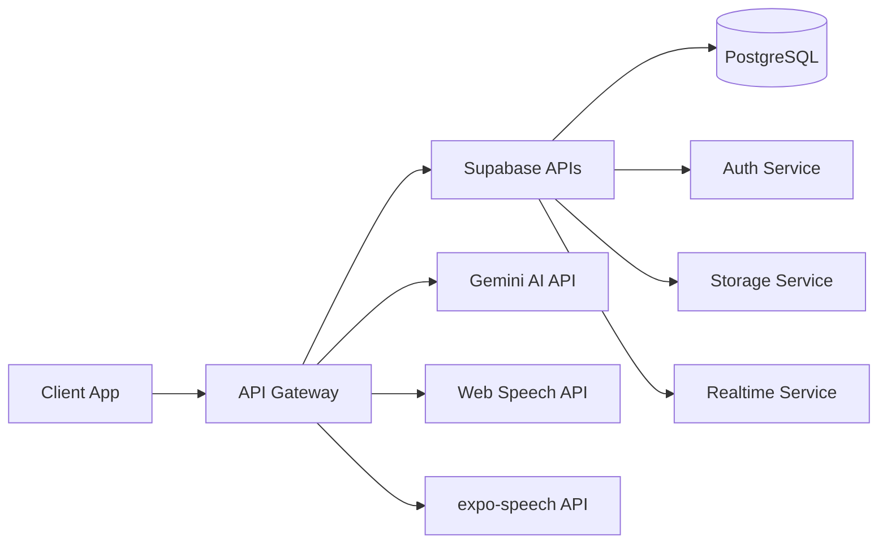

# API仕様書 - WorldSpeakAI

## 🔌 API概要

WorldSpeakAIは複数の外部APIとSupabase APIを統合し、多言語学習プラットフォームを実現します。

### APIアーキテクチャ


## 📡 Supabase API

### 認証API

#### 1. サインアップ（多言語対応）
```typescript
// エンドポイント
POST /auth/v1/signup

// リクエスト型定義
interface SignUpRequest {
  email: string;
  password: string;
  options?: {
    data?: {
      full_name: string;
      native_language: string;
      target_languages: string[];
      timezone: string;
      preferred_learning_time?: {
        start: string;
        end: string;
      };
    };
    emailRedirectTo?: string;
  };
}

// レスポンス型定義
interface SignUpResponse {
  user: User;
  session: Session | null;
}

// 実装例
export async function signUpUser(userData: SignUpData): Promise<AuthResponse> {
  const { data, error } = await supabase.auth.signUp({
    email: userData.email,
    password: userData.password,
    options: {
      data: {
        full_name: userData.fullName,
        native_language: userData.nativeLanguage,
        target_languages: userData.targetLanguages,
        timezone: Intl.DateTimeFormat().resolvedOptions().timeZone
      },
      emailRedirectTo: `${window.location.origin}/auth/callback`
    }
  });
  
  if (error) throw new APIError(error.message, 'AUTH_SIGNUP_FAILED');
  
  // プロフィール作成
  if (data.user) {
    await createUserProfile(data.user.id, userData);
  }
  
  return data;
}
```

#### 2. ログイン/セッション管理
```typescript
// ログイン
POST /auth/v1/token?grant_type=password

interface SignInRequest {
  email: string;
  password: string;
}

// セッション更新
POST /auth/v1/token?grant_type=refresh_token

// セッション取得
GET /auth/v1/session

// 実装例
class AuthService {
  async signIn(credentials: SignInRequest): Promise<AuthResponse> {
    const { data, error } = await supabase.auth.signInWithPassword({
      email: credentials.email,
      password: credentials.password
    });
    
    if (error) throw new APIError(error.message, 'AUTH_SIGNIN_FAILED');
    
    // 最終ログイン時刻更新
    await this.updateLastActive(data.user.id);
    
    return data;
  }
  
  async refreshSession(): Promise<Session | null> {
    const { data: { session }, error } = await supabase.auth.refreshSession();
    if (error) throw new APIError(error.message, 'SESSION_REFRESH_FAILED');
    return session;
  }
  
  async signOut(): Promise<void> {
    const { error } = await supabase.auth.signOut();
    if (error) throw new APIError(error.message, 'SIGNOUT_FAILED');
  }
}
```

### データベースAPI (PostgREST)

#### 1. プロフィール管理
```typescript
// プロフィール取得（多言語対応）
GET /rest/v1/profiles?id=eq.{user_id}&select=*,language_settings(*)

// プロフィール更新
PATCH /rest/v1/profiles?id=eq.{user_id}

// 実装例
interface ProfileService {
  async getProfile(userId: string): Promise<MultilingualProfile> {
    const { data, error } = await supabase
      .from('profiles')
      .select(`
        *,
        language_settings (
          language_code,
          proficiency_level,
          learning_goals,
          preferred_voice_id,
          speech_rate
        ),
        subscriptions (
          plan_type,
          status,
          monthly_minutes_limit,
          monthly_minutes_used
        )
      `)
      .eq('id', userId)
      .single();
    
    if (error) throw new APIError(error.message, 'PROFILE_FETCH_FAILED');
    return data;
  }
  
  async updateProfile(userId: string, updates: Partial<Profile>): Promise<Profile> {
    const { data, error } = await supabase
      .from('profiles')
      .update(updates)
      .eq('id', userId)
      .select()
      .single();
    
    if (error) throw new APIError(error.message, 'PROFILE_UPDATE_FAILED');
    return data;
  }
}
```

#### 2. 会話管理（多言語対応）
```typescript
// 会話作成
POST /rest/v1/conversations

// 会話履歴取得（言語別フィルタ）
GET /rest/v1/conversations?user_id=eq.{user_id}&language_pair->>target=eq.{language}

// 実装例
class ConversationService {
  async createConversation(params: {
    userId: string;
    languagePair: LanguagePair;
    scenario: string;
    specialization?: string;
    scriptId?: string;
  }): Promise<Conversation> {
    const { data, error } = await supabase
      .from('conversations')
      .insert({
        user_id: params.userId,
        language_pair: params.languagePair,
        scenario: params.scenario,
        specialization: params.specialization,
        script_id: params.scriptId,
        script_enabled: !!params.scriptId
      })
      .select()
      .single();
    
    if (error) throw new APIError(error.message, 'CONVERSATION_CREATE_FAILED');
    
    // リアルタイムサブスクリプション開始
    this.subscribeToConversation(data.id);
    
    return data;
  }
  
  async getConversationHistory(
    userId: string,
    filters?: {
      language?: string;
      dateFrom?: Date;
      dateTo?: Date;
      limit?: number;
    }
  ): Promise<Conversation[]> {
    let query = supabase
      .from('conversations')
      .select(`
        *,
        messages (
          id,
          content,
          language,
          is_ai,
          message_type,
          created_at,
          pronunciation_analysis,
          grammar_corrections
        )
      `)
      .eq('user_id', userId)
      .order('created_at', { ascending: false });
    
    if (filters?.language) {
      query = query.eq('language_pair->>target', filters.language);
    }
    
    if (filters?.limit) {
      query = query.limit(filters.limit);
    }
    
    const { data, error } = await query;
    
    if (error) throw new APIError(error.message, 'HISTORY_FETCH_FAILED');
    return data;
  }
}
```

#### 3. メッセージ管理（多言語）
```typescript
// メッセージ保存
POST /rest/v1/messages

// バッチメッセージ取得
GET /rest/v1/messages?conversation_id=eq.{id}&order=created_at

// 実装例
interface MessageService {
  async saveMessage(message: {
    conversationId: string;
    userId: string;
    content: string;
    language: string;
    isAi: boolean;
    messageType: MessageType;
    audioUrl?: string;
    metadata?: MessageMetadata;
  }): Promise<Message> {
    // 発音分析（ユーザーメッセージの場合）
    let pronunciationAnalysis = null;
    if (!message.isAi && message.audioUrl) {
      pronunciationAnalysis = await this.analyzePronunciation(
        message.audioUrl,
        message.content,
        message.language
      );
    }
    
    const { data, error } = await supabase
      .from('messages')
      .insert({
        conversation_id: message.conversationId,
        user_id: message.userId,
        content: message.content,
        language: message.language,
        is_ai: message.isAi,
        message_type: message.messageType,
        audio_url: message.audioUrl,
        pronunciation_analysis: pronunciationAnalysis,
        metadata: message.metadata
      })
      .select()
      .single();
    
    if (error) throw new APIError(error.message, 'MESSAGE_SAVE_FAILED');
    
    // リアルタイム通知
    await this.broadcastMessage(data);
    
    return data;
  }
}
```

### ストレージAPI

#### 1. 音声ファイル管理
```typescript
// 音声アップロード
POST /storage/v1/object/audio/{user_id}/{conversation_id}/{message_id}.webm

// 音声取得
GET /storage/v1/object/audio/{path}

// 実装例
class AudioStorageService {
  async uploadAudio(
    blob: Blob,
    userId: string,
    conversationId: string,
    messageId: string
  ): Promise<string> {
    const fileName = `${userId}/${conversationId}/${messageId}.webm`;
    
    const { data, error } = await supabase.storage
      .from('audio')
      .upload(fileName, blob, {
        contentType: 'audio/webm',
        cacheControl: '3600',
        upsert: false
      });
    
    if (error) throw new APIError(error.message, 'AUDIO_UPLOAD_FAILED');
    
    // 公開URL取得
    const { data: { publicUrl } } = supabase.storage
      .from('audio')
      .getPublicUrl(fileName);
    
    return publicUrl;
  }
  
  async deleteOldAudio(daysOld: number = 30): Promise<void> {
    // 古い音声ファイルの自動削除
    const cutoffDate = new Date();
    cutoffDate.setDate(cutoffDate.getDate() - daysOld);
    
    // 実装はSupabase Functionsで行う
  }
}
```

### リアルタイムAPI

```typescript
// リアルタイムサブスクリプション
interface RealtimeService {
  subscribeToConversation(conversationId: string) {
    return supabase
      .channel(`conversation:${conversationId}`)
      .on(
        'postgres_changes',
        {
          event: 'INSERT',
          schema: 'public',
          table: 'messages',
          filter: `conversation_id=eq.${conversationId}`
        },
        (payload) => {
          this.handleNewMessage(payload.new as Message);
        }
      )
      .subscribe();
  }
  
  subscribeToUsageUpdates(userId: string) {
    return supabase
      .channel(`usage:${userId}`)
      .on(
        'postgres_changes',
        {
          event: 'UPDATE',
          schema: 'public',
          table: 'subscriptions',
          filter: `user_id=eq.${userId}`
        },
        (payload) => {
          this.handleUsageUpdate(payload.new as Subscription);
        }
      )
      .subscribe();
  }
}
```

## 🤖 Google Gemini AI API

### 設定と初期化
```typescript
import { GoogleGenerativeAI } from '@google/generative-ai';

class GeminiService {
  private genAI: GoogleGenerativeAI;
  private model: GenerativeModel;
  
  constructor() {
    this.genAI = new GoogleGenerativeAI(process.env.GEMINI_API_KEY!);
    this.model = this.genAI.getGenerativeModel({ 
      model: 'gemini-1.5-flash',
      generationConfig: {
        temperature: 0.7,
        topK: 40,
        topP: 0.95,
        maxOutputTokens: 1024
      }
    });
  }
}
```

### 多言語会話生成
```typescript
// エンドポイント
POST https://generativelanguage.googleapis.com/v1beta/models/gemini-1.5-flash:generateContent

// 会話応答生成
interface ConversationAI {
  async generateResponse(params: {
    userInput: string;
    conversationHistory: Message[];
    languagePair: LanguagePair;
    scenario: string;
    specialization?: string;
    scriptGuidance?: string;
    culturalContext?: CulturalSettings;
  }): Promise<AIResponse> {
    const prompt = this.buildMultilingualPrompt(params);
    
    try {
      const result = await this.model.generateContent({
        contents: [{
          role: 'user',
          parts: [{
            text: prompt
          }]
        }],
        safetySettings: this.getSafetySettings(params.languagePair)
      });
      
      const response = await result.response;
      const text = response.text();
      
      // 応答の検証と後処理
      return this.processAIResponse(text, params);
    } catch (error) {
      if (error.status === 429) {
        // レート制限対応
        return this.handleRateLimit(params);
      }
      throw new APIError('AI generation failed', 'GEMINI_ERROR', error.status);
    }
  }
  
  private buildMultilingualPrompt(params: ConversationParams): string {
    return `
    You are a language learning AI assistant helping a ${params.languagePair.native} speaker learn ${params.languagePair.target}.
    
    Context:
    - Scenario: ${params.scenario}
    - Specialization: ${params.specialization || 'general conversation'}
    - User Level: ${this.getUserLevel(params.languagePair.target)}
    - Cultural Context: ${JSON.stringify(params.culturalContext)}
    
    Conversation History:
    ${this.formatConversationHistory(params.conversationHistory)}
    
    ${params.scriptGuidance ? `Script Guidance: ${params.scriptGuidance}` : ''}
    
    User said in ${params.languagePair.target}: "${params.userInput}"
    
    Instructions:
    1. Respond naturally in ${params.languagePair.target}
    2. Match the user's proficiency level
    3. Include appropriate cultural context
    4. If specialized vocabulary is needed, use it appropriately
    5. Keep response concise and conversational
    
    Response:`;
  }
}
```

### 台本生成API
```typescript
interface ScriptGenerationAI {
  async generateScript(params: {
    scenario: string;
    languagePair: LanguagePair;
    userLevel: ProficiencyLevel;
    duration: number;
    specialization?: string;
    culturalSettings?: CulturalSettings;
  }): Promise<ConversationScript> {
    const prompt = `
    Generate a conversation script for language learning:
    
    Parameters:
    - Native Language: ${params.languagePair.native}
    - Target Language: ${params.languagePair.target}
    - Scenario: ${params.scenario}
    - User Level: ${params.userLevel}
    - Duration: ${params.duration} minutes
    - Specialization: ${params.specialization || 'none'}
    
    Requirements:
    1. Create a natural dialogue flow
    2. Include ${params.duration * 2} exchanges (user and AI)
    3. Gradually increase complexity
    4. Add pronunciation hints for difficult words
    5. Include cultural notes where relevant
    6. Provide alternative phrases for flexibility
    
    Format the output as JSON with this structure:
    {
      "title": "Script title in both languages",
      "segments": [
        {
          "order": 1,
          "speaker": "ai" | "user",
          "text": "Main text",
          "alternatives": ["alt1", "alt2"],
          "pronunciationHint": "hint if needed",
          "culturalNote": "note if relevant"
        }
      ],
      "vocabulary": {
        "word": {
          "translation": "...",
          "pronunciation": "...",
          "usage": "..."
        }
      }
    }`;
    
    const result = await this.model.generateContent(prompt);
    const response = await result.response;
    
    try {
      const script = JSON.parse(response.text());
      return this.validateAndEnhanceScript(script, params);
    } catch (error) {
      throw new APIError('Script generation failed', 'SCRIPT_PARSE_ERROR');
    }
  }
}
```

### エラーハンドリングとレート制限
```typescript
interface GeminiErrorHandler {
  handleError(error: any): never {
    const errorMap: Record<number, string> = {
      400: 'Invalid request format',
      401: 'Invalid API key',
      403: 'API key lacks required permissions',
      429: 'Rate limit exceeded',
      500: 'Internal server error',
      503: 'Service temporarily unavailable'
    };
    
    const message = errorMap[error.status] || 'Unknown error';
    throw new APIError(message, `GEMINI_${error.status}`, error.status);
  }
  
  async handleRateLimit(params: any): Promise<any> {
    // 簡易的なフォールバック応答
    const fallbackResponses = {
      en: "I understand. Let me think about that for a moment.",
      ja: "なるほど。少し考えさせてください。",
      zh: "我明白了。让我想一想。",
      es: "Entiendo. Déjame pensar un momento.",
      fr: "Je comprends. Laissez-moi réfléchir un instant."
    };
    
    return {
      text: fallbackResponses[params.languagePair.target] || fallbackResponses.en,
      isFallback: true
    };
  }
}
```

## 🎤 Web Speech API

### 多言語音声認識
```typescript
class MultilingualSpeechRecognition {
  private recognition: SpeechRecognition;
  
  constructor() {
    const SpeechRecognition = window.SpeechRecognition || window.webkitSpeechRecognition;
    this.recognition = new SpeechRecognition();
  }
  
  configure(language: string, options?: SpeechRecognitionOptions) {
    // 言語別最適化設定
    const languageConfigs: Record<string, Partial<SpeechRecognitionOptions>> = {
      'ja-JP': {
        continuous: false,
        interimResults: true,
        maxAlternatives: 3
      },
      'zh-CN': {
        continuous: false,
        interimResults: true,
        maxAlternatives: 5
      },
      'en-US': {
        continuous: true,
        interimResults: false,
        maxAlternatives: 1
      }
    };
    
    const config = {
      ...languageConfigs[language] || {},
      ...options
    };
    
    this.recognition.lang = language;
    this.recognition.continuous = config.continuous ?? false;
    this.recognition.interimResults = config.interimResults ?? false;
    this.recognition.maxAlternatives = config.maxAlternatives ?? 1;
  }
  
  async startRecognition(): Promise<string> {
    return new Promise((resolve, reject) => {
      this.recognition.onresult = (event) => {
        const result = event.results[event.results.length - 1];
        const transcript = result[0].transcript;
        
        if (result.isFinal) {
          resolve(transcript);
        }
      };
      
      this.recognition.onerror = (event) => {
        const errorMessages: Record<string, string> = {
          'no-speech': 'No speech detected',
          'audio-capture': 'Microphone not available',
          'not-allowed': 'Microphone permission denied',
          'network': 'Network error',
          'aborted': 'Recognition aborted'
        };
        
        reject(new APIError(
          errorMessages[event.error] || 'Speech recognition error',
          `SPEECH_${event.error.toUpperCase()}`
        ));
      };
      
      this.recognition.start();
    });
  }
}
```

### 対応言語マトリックス
```typescript
const SUPPORTED_LANGUAGES = {
  // 主要言語
  'en-US': { name: 'English (US)', region: 'United States' },
  'en-GB': { name: 'English (UK)', region: 'United Kingdom' },
  'en-AU': { name: 'English (AU)', region: 'Australia' },
  'ja-JP': { name: '日本語', region: '日本' },
  'zh-CN': { name: '中文 (简体)', region: '中国' },
  'zh-TW': { name: '中文 (繁體)', region: '台灣' },
  'ko-KR': { name: '한국어', region: '대한민국' },
  
  // ヨーロッパ言語
  'es-ES': { name: 'Español', region: 'España' },
  'es-MX': { name: 'Español (MX)', region: 'México' },
  'fr-FR': { name: 'Français', region: 'France' },
  'de-DE': { name: 'Deutsch', region: 'Deutschland' },
  'it-IT': { name: 'Italiano', region: 'Italia' },
  'pt-PT': { name: 'Português', region: 'Portugal' },
  'pt-BR': { name: 'Português (BR)', region: 'Brasil' },
  'ru-RU': { name: 'Русский', region: 'Россия' },
  
  // その他
  'ar-SA': { name: 'العربية', region: 'السعودية' },
  'hi-IN': { name: 'हिन्दी', region: 'भारत' },
  'th-TH': { name: 'ไทย', region: 'ประเทศไทย' },
  'vi-VN': { name: 'Tiếng Việt', region: 'Việt Nam' }
} as const;
```

## 🔊 expo-speech API

### 多言語音声合成
```typescript
import * as Speech from 'expo-speech';

class MultilingualTextToSpeech {
  private voiceCache = new Map<string, Voice>();
  
  async speak(text: string, language: string, options?: SpeechOptions) {
    // 言語別最適化
    const languageSettings = this.getLanguageSettings(language);
    
    const speechOptions: Speech.SpeechOptions = {
      language,
      pitch: options?.pitch ?? languageSettings.pitch,
      rate: options?.rate ?? languageSettings.rate,
      volume: options?.volume ?? 1.0,
      voice: options?.voice ?? await this.getBestVoice(language)
    };
    
    // 発話前処理
    const processedText = this.preprocessText(text, language);
    
    return new Promise<void>((resolve, reject) => {
      Speech.speak(processedText, {
        ...speechOptions,
        onDone: resolve,
        onError: reject,
        onStart: () => this.onSpeechStart(language),
        onStopped: () => this.onSpeechStop(language)
      });
    });
  }
  
  private getLanguageSettings(language: string): LanguageVoiceSettings {
    const settings: Record<string, LanguageVoiceSettings> = {
      'ja': { pitch: 1.0, rate: 0.9, preferGender: 'female' },
      'zh': { pitch: 1.0, rate: 0.85, preferGender: 'female' },
      'ko': { pitch: 1.0, rate: 0.9, preferGender: 'female' },
      'en': { pitch: 1.0, rate: 1.0, preferGender: 'neutral' },
      'es': { pitch: 1.0, rate: 1.1, preferGender: 'neutral' },
      'fr': { pitch: 1.0, rate: 1.0, preferGender: 'neutral' }
    };
    
    return settings[language.split('-')[0]] || { pitch: 1.0, rate: 1.0 };
  }
  
  async getBestVoice(language: string): Promise<string | undefined> {
    const voices = await Speech.getAvailableVoicesAsync();
    const langVoices = voices.filter(v => v.language.startsWith(language));
    
    // 優先順位: プレミアム > 高品質 > 標準
    const priorityVoices = langVoices.sort((a, b) => {
      const scoreA = this.getVoiceScore(a);
      const scoreB = this.getVoiceScore(b);
      return scoreB - scoreA;
    });
    
    return priorityVoices[0]?.identifier;
  }
  
  private preprocessText(text: string, language: string): string {
    // 言語別テキスト前処理
    switch (language.split('-')[0]) {
      case 'ja':
        // 日本語: 数字を読みやすく
        return text.replace(/(\d+)/g, ' $1 ');
      case 'zh':
        // 中国語: ピンイン記号の処理
        return text;
      case 'en':
        // 英語: 略語の展開
        return text
          .replace(/\bDr\./g, 'Doctor')
          .replace(/\bMr\./g, 'Mister')
          .replace(/\bMs\./g, 'Miss');
      default:
        return text;
    }
  }
}
```

## 📊 使用制限とベストプラクティス

### API制限管理
```typescript
class APILimitManager {
  private limits = {
    supabase: {
      auth: { requests: Infinity, window: 0 },
      database: { requests: 1000, window: 60000 }, // 1000/分
      storage: { bandwidth: 2 * 1024 * 1024 * 1024, monthly: true } // 2GB/月
    },
    gemini: {
      free: { requests: 60, window: 60000 }, // 60/分
      paid: { requests: 1000, window: 60000 } // 1000/分
    }
  };
  
  private usage = new Map<string, { count: number; resetAt: number }>();
  
  async checkLimit(api: string, tier: string = 'free'): Promise<boolean> {
    const key = `${api}:${tier}`;
    const limit = this.getLimit(api, tier);
    const current = this.usage.get(key) || { count: 0, resetAt: 0 };
    
    if (Date.now() > current.resetAt) {
      current.count = 0;
      current.resetAt = Date.now() + limit.window;
    }
    
    if (current.count >= limit.requests) {
      throw new APIError('Rate limit exceeded', 'RATE_LIMIT', 429);
    }
    
    current.count++;
    this.usage.set(key, current);
    return true;
  }
}
```

### 統合エラーハンドリング
```typescript
export class APIError extends Error {
  constructor(
    message: string,
    public code: string,
    public status?: number,
    public details?: any
  ) {
    super(message);
    this.name = 'APIError';
  }
  
  toJSON() {
    return {
      name: this.name,
      message: this.message,
      code: this.code,
      status: this.status,
      details: this.details
    };
  }
}

// グローバルエラーハンドラー
export async function handleAPIError(error: any): Promise<never> {
  console.error('[API Error]', error);
  
  if (error instanceof APIError) {
    throw error;
  }
  
  // Supabaseエラー
  if (error?.code?.startsWith('PGRST')) {
    throw new APIError(
      'Database error',
      error.code,
      400,
      error.details
    );
  }
  
  // ネットワークエラー
  if (error?.name === 'NetworkError') {
    throw new APIError(
      'Network connection failed',
      'NETWORK_ERROR',
      0
    );
  }
  
  // デフォルト
  throw new APIError(
    'An unexpected error occurred',
    'UNKNOWN_ERROR',
    500
  );
}
```

### レスポンスキャッシング
```typescript
class APICache {
  private cache = new Map<string, CacheEntry>();
  private readonly DEFAULT_TTL = 5 * 60 * 1000; // 5分
  
  set(key: string, data: any, ttl: number = this.DEFAULT_TTL) {
    this.cache.set(key, {
      data,
      expiry: Date.now() + ttl,
      hits: 0
    });
    
    // キャッシュサイズ管理
    if (this.cache.size > 100) {
      this.evictLRU();
    }
  }
  
  get<T>(key: string): T | null {
    const entry = this.cache.get(key);
    
    if (!entry) return null;
    
    if (Date.now() > entry.expiry) {
      this.cache.delete(key);
      return null;
    }
    
    entry.hits++;
    return entry.data as T;
  }
  
  private evictLRU() {
    let lruKey = '';
    let minHits = Infinity;
    
    for (const [key, entry] of this.cache) {
      if (entry.hits < minHits) {
        minHits = entry.hits;
        lruKey = key;
      }
    }
    
    if (lruKey) {
      this.cache.delete(lruKey);
    }
  }
}
```

### APIクライアント統合
```typescript
export class WorldSpeakAPIClient {
  private authService: AuthService;
  private conversationService: ConversationService;
  private geminiService: GeminiService;
  private speechService: MultilingualSpeechRecognition;
  private ttsService: MultilingualTextToSpeech;
  private cache: APICache;
  private limitManager: APILimitManager;
  
  constructor() {
    this.initializeServices();
    this.setupInterceptors();
  }
  
  private setupInterceptors() {
    // リクエストインターセプター
    supabase.auth.onAuthStateChange((event, session) => {
      if (event === 'SIGNED_OUT') {
        this.cache.clear();
      }
    });
    
    // エラーインターセプター
    window.addEventListener('unhandledrejection', (event) => {
      if (event.reason instanceof APIError) {
        this.handleGlobalError(event.reason);
      }
    });
  }
  
  // 統合メソッド例
  async startConversation(params: ConversationStartParams): Promise<ConversationSession> {
    // レート制限チェック
    await this.limitManager.checkLimit('gemini', params.subscriptionTier);
    
    // 会話作成
    const conversation = await this.conversationService.createConversation(params);
    
    // 台本生成（必要な場合）
    if (params.scriptEnabled) {
      const script = await this.geminiService.generateScript({
        ...params,
        conversationId: conversation.id
      });
      conversation.script = script;
    }
    
    // 音声認識開始準備
    this.speechService.configure(params.languagePair.target);
    
    return {
      conversation,
      startRecording: () => this.speechService.startRecognition(),
      sendMessage: (text: string) => this.processUserMessage(conversation.id, text),
      endConversation: () => this.endConversation(conversation.id)
    };
  }
}
```

この詳細なAPI仕様書により、claude codeは以下を実現できます：

1. **完全な多言語対応API実装**
2. **型安全なAPI通信**
3. **適切なエラーハンドリング**
4. **効率的なキャッシング戦略**
5. **レート制限の適切な管理**