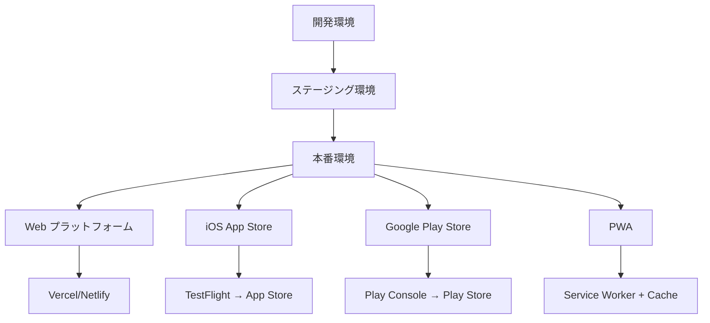

# デプロイメント手順書 - WorldSpeakAI

## 🚀 デプロイメント概要

WorldSpeakAIは複数のプラットフォームに対応したマルチターゲットデプロイメントを採用しています。

### デプロイメント戦略


## 🌐 Web版デプロイメント

### Vercel（推奨）

#### 1. プロジェクト準備
```bash
# Web用最適化ビルド
npm run build:web:optimized

# ビルド結果確認
ls -la dist/
# 期待される出力: index.html, static/, assets/, manifest.json
```

#### 2. Vercel設定ファイル
```json
// vercel.json
{
  "version": 2,
  "builds": [
    {
      "src": "package.json",
      "use": "@vercel/static-build",
      "config": {
        "distDir": "dist"
      }
    }
  ],
  "routes": [
    {
      "src": "/api/(.*)",
      "dest": "/api/$1"
    },
    {
      "handle": "filesystem"
    },
    {
      "src": "/(.*)",
      "dest": "/index.html"
    }
  ],
  "env": {
    "EXPO_PUBLIC_SUPABASE_URL": "@supabase_url",
    "EXPO_PUBLIC_SUPABASE_ANON_KEY": "@supabase_anon_key"
  },
  "functions": {
    "app/api/**/*.ts": {
      "runtime": "nodejs18.x"
    }
  },
  "headers": [
    {
      "source": "/(.*)",
      "headers": [
        {
          "key": "X-Content-Type-Options",
          "value": "nosniff"
        },
        {
          "key": "X-Frame-Options",
          "value": "DENY"
        },
        {
          "key": "X-XSS-Protection",
          "value": "1; mode=block"
        }
      ]
    }
  ]
}
```

#### 3. 自動デプロイ設定
```bash
# Vercel CLIインストール
npm i -g vercel

# プロジェクト初期化
vercel

# 本番環境変数設定
vercel env add EXPO_PUBLIC_SUPABASE_URL production
vercel env add EXPO_PUBLIC_SUPABASE_ANON_KEY production
vercel env add GEMINI_API_KEY production
vercel env add SENTRY_DSN production

# カスタムドメイン設定
vercel domains add worldspeakai.com
vercel domains add www.worldspeakai.com
```

### Netlify（代替オプション）

#### 1. 設定ファイル
```toml
# netlify.toml
[build]
  command = "npm run build:web:production"
  publish = "dist"
  ignore = "git diff --quiet $CACHED_COMMIT_REF $COMMIT_REF -- docs/ README.md"

[build.environment]
  NODE_VERSION = "18"
  NPM_VERSION = "10"
  EXPO_PUBLIC_ENV = "production"

[context.production.environment]
  NODE_ENV = "production"

[context.staging.environment]
  NODE_ENV = "staging"

[[redirects]]
  from = "/api/*"
  to = "/.netlify/functions/:splat"
  status = 200

[[redirects]]
  from = "/*"
  to = "/index.html"
  status = 200

[[headers]]
  for = "/*"
  [headers.values]
    X-Frame-Options = "DENY"
    X-XSS-Protection = "1; mode=block"
    X-Content-Type-Options = "nosniff"
    Referrer-Policy = "strict-origin-when-cross-origin"

[[headers]]
  for = "/static/*"
  [headers.values]
    Cache-Control = "public, max-age=31536000, immutable"
```

### PWA最適化

#### 1. Service Worker設定
```javascript
// public/sw.js
const CACHE_NAME = 'worldspeakai-v1.0.0';
const URLS_TO_CACHE = [
  '/',
  '/static/js/bundle.js',
  '/static/css/main.css',
  '/manifest.json'
];

// 多言語音声キャッシュ戦略
const VOICE_CACHE_NAME = 'voice-cache-v1';
const SCRIPT_CACHE_NAME = 'script-cache-v1';

self.addEventListener('install', (event) => {
  event.waitUntil(
    caches.open(CACHE_NAME)
      .then((cache) => cache.addAll(URLS_TO_CACHE))
  );
});

self.addEventListener('fetch', (event) => {
  // 音声ファイルの特別なキャッシュ戦略
  if (event.request.url.includes('/audio/')) {
    event.respondWith(
      caches.open(VOICE_CACHE_NAME).then((cache) => {
        return cache.match(event.request).then((response) => {
          if (response) {
            return response;
          }
          return fetch(event.request).then((fetchResponse) => {
            cache.put(event.request, fetchResponse.clone());
            return fetchResponse;
          });
        });
      })
    );
    return;
  }

  // デフォルトキャッシュ戦略
  event.respondWith(
    caches.match(event.request)
      .then((response) => response || fetch(event.request))
  );
});
```

## 📱 モバイルアプリデプロイメント

### EAS Build設定（全プラットフォーム）

#### 1. EAS初期設定
```bash
# EAS CLIインストール
npm install -g eas-cli@latest

# Expoログイン
eas login

# プロジェクト初期化
eas build:configure
```

#### 2. 高度なEAS設定
```json
// eas.json
{
  "cli": {
    "version": ">= 5.2.0"
  },
  "build": {
    "development": {
      "developmentClient": true,
      "distribution": "internal",
      "ios": {
        "simulator": true
      },
      "env": {
        "ENVIRONMENT": "development",
        "EXPO_PUBLIC_SUPABASE_URL": "http://localhost:54321"
      }
    },
    "staging": {
      "distribution": "internal",
      "channel": "staging",
      "env": {
        "ENVIRONMENT": "staging"
      },
      "ios": {
        "buildConfiguration": "Release",
        "bundleIdentifier": "com.worldspeakai.staging"
      },
      "android": {
        "buildType": "apk",
        "gradleCommand": ":app:assembleRelease"
      }
    },
    "production": {
      "channel": "production",
      "env": {
        "ENVIRONMENT": "production"
      },
      "ios": {
        "buildConfiguration": "Release",
        "bundleIdentifier": "com.worldspeakai.app",
        "autoIncrement": "buildNumber"
      },
      "android": {
        "buildType": "aab",
        "gradleCommand": ":app:bundleRelease"
      }
    }
  },
  "submit": {
    "production": {
      "ios": {
        "appleId": "your-apple-id@email.com",
        "ascAppId": "1234567890",
        "appleTeamId": "YOUR_TEAM_ID"
      },
      "android": {
        "serviceAccountKeyPath": "./android-upload-key.json",
        "track": "production"
      }
    }
  }
}
```

### iOS App Store

#### 1. Apple Developer設定
```bash
# 開発証明書設定
eas credentials:configure:ios

# App Store Connect設定確認
eas build:configure:ios
```

#### 2. app.json iOS設定
```json
{
  "expo": {
    "ios": {
      "bundleIdentifier": "com.worldspeakai.app",
      "buildNumber": "1.0.0",
      "supportsTablet": true,
      "infoPlist": {
        "NSMicrophoneUsageDescription": "This app uses the microphone for language learning conversations.",
        "NSSpeechRecognitionUsageDescription": "This app uses speech recognition to help you practice languages.",
        "CFBundleAllowMixedLocalizations": true,
        "ITSAppUsesNonExemptEncryption": false
      },
      "config": {
        "usesNonExemptEncryption": false
      },
      "associatedDomains": [
        "applinks:worldspeakai.com",
        "applinks:www.worldspeakai.com"
      ]
    }
  }
}
```

#### 3. ビルド・提出プロセス
```bash
# プロダクションビルド
eas build --platform ios --profile production

# TestFlightアップロード
eas submit --platform ios --latest

# App Store提出状況確認
eas submit:status
```

### Google Play Store

#### 1. Google Play Console設定
```json
// app.json Android設定
{
  "expo": {
    "android": {
      "package": "com.worldspeakai.app",
      "versionCode": 1,
      "compileSdkVersion": 34,
      "targetSdkVersion": 34,
      "permissions": [
        "RECORD_AUDIO",
        "INTERNET",
        "WAKE_LOCK",
        "ACCESS_NETWORK_STATE"
      ],
      "adaptiveIcon": {
        "foregroundImage": "./assets/adaptive-icon.png",
        "backgroundColor": "#FFFFFF"
      },
      "config": {
        "googleSignIn": {
          "apiKey": "YOUR_GOOGLE_API_KEY",
          "certificateHash": "YOUR_CERTIFICATE_HASH"
        }
      }
    }
  }
}
```

#### 2. 署名とセキュリティ
```bash
# Upload key作成
keytool -genkeypair -v -storetype PKCS12 -keystore upload-keystore.p12 -alias upload -keyalg RSA -keysize 2048 -validity 9125

# EASでの署名設定
eas credentials:configure:android

# AAB（Android App Bundle）ビルド
eas build --platform android --profile production
```

#### 3. Play Store提出
```bash
# Google Play Console提出
eas submit --platform android --latest

# 段階的リリース設定
eas submit --platform android --track=internal
eas submit --platform android --track=alpha
eas submit --platform android --track=beta
eas submit --platform android --track=production
```

## 🐳 コンテナ化デプロイメント

### 最適化Dockerfile
```dockerfile
# マルチステージビルド
FROM node:18-alpine AS builder

WORKDIR /app

# 依存関係のインストール
COPY package*.json ./
RUN npm ci --only=production && npm cache clean --force

# ソースコード
COPY . .

# ビルド実行
RUN npm run build:web:production

# 本番用軽量イメージ
FROM nginx:alpine AS production

# Nginx設定
COPY nginx.conf /etc/nginx/nginx.conf

# ビルド結果コピー
COPY --from=builder /app/dist /usr/share/nginx/html

# ヘルスチェック
HEALTHCHECK --interval=30s --timeout=3s --start-period=5s --retries=3 \
  CMD curl -f http://localhost/ || exit 1

EXPOSE 80

CMD ["nginx", "-g", "daemon off;"]
```

### Docker Compose（本番用）
```yaml
# docker-compose.prod.yml
version: '3.8'

services:
  web:
    build:
      context: .
      dockerfile: Dockerfile
      target: production
    ports:
      - "80:80"
      - "443:443"
    environment:
      - ENVIRONMENT=production
    volumes:
      - ./ssl:/etc/nginx/ssl:ro
      - ./logs:/var/log/nginx
    restart: unless-stopped
    networks:
      - worldspeakai

  # Redis（キャッシュ）
  redis:
    image: redis:7-alpine
    volumes:
      - redis_data:/data
    restart: unless-stopped
    networks:
      - worldspeakai

  # Nginx Proxy（ロードバランシング）
  proxy:
    image: nginx:alpine
    ports:
      - "80:80"
      - "443:443"
    volumes:
      - ./nginx-proxy.conf:/etc/nginx/nginx.conf:ro
      - ./ssl:/etc/nginx/ssl:ro
    depends_on:
      - web
    restart: unless-stopped
    networks:
      - worldspeakai

volumes:
  redis_data:

networks:
  worldspeakai:
    driver: bridge
```

## ⚙️ 本番環境設定

### セキュリティ強化

#### 1. 環境変数暗号化
```bash
# Sops（Secrets OPerationS）使用
# .sops.yaml
creation_rules:
  - path_regex: \.env\.production$
    kms: 'arn:aws:kms:us-east-1:123456789012:key/12345678-1234-1234-1234-123456789012'

# 暗号化
sops -e .env.production > .env.production.enc

# 復号化（デプロイ時）
sops -d .env.production.enc > .env.production
```

#### 2. CSP（Content Security Policy）
```javascript
// next.config.js または webpack設定
const securityHeaders = [
  {
    key: 'Content-Security-Policy',
    value: `
      default-src 'self';
      script-src 'self' 'unsafe-eval' 'unsafe-inline' https://apis.google.com;
      style-src 'self' 'unsafe-inline';
      img-src 'self' data: https:;
      font-src 'self';
      connect-src 'self' https://*.supabase.co https://generativelanguage.googleapis.com;
      media-src 'self' https://*.supabase.co;
      worker-src 'self' blob:;
    `.replace(/\s{2,}/g, ' ').trim()
  }
];
```

### パフォーマンス最適化

#### 1. CDN設定（Cloudflare）
```bash
# Cloudflare設定
# 1. DNS設定
# 2. SSL/TLS → Full (Strict)
# 3. Speed → Optimization → Auto Minify: HTML, CSS, JS
# 4. Caching → Browser Cache TTL: 4 hours
# 5. Page Rules:
#   - *.worldspeakai.com/static/* → Cache Level: Cache Everything, TTL: 1 month
#   - *.worldspeakai.com/api/* → Cache Level: Bypass
```

#### 2. リソース圧縮
```javascript
// webpack.config.js
const CompressionPlugin = require('compression-webpack-plugin');

module.exports = {
  plugins: [
    new CompressionPlugin({
      algorithm: 'gzip',
      test: /\.(js|css|html|svg)$/,
      threshold: 8192,
      minRatio: 0.8,
    }),
  ],
  optimization: {
    splitChunks: {
      chunks: 'all',
      cacheGroups: {
        vendor: {
          test: /[\\/]node_modules[\\/]/,
          name: 'vendors',
          chunks: 'all',
        },
        common: {
          name: 'common',
          minChunks: 2,
          chunks: 'all',
          enforce: true,
        },
      },
    },
  },
};
```

## 📊 モニタリング・ログ

### APM（Application Performance Monitoring）

#### 1. Sentry統合
```typescript
// src/lib/monitoring.ts
import * as Sentry from '@sentry/expo';
import { ExpoConfig } from '@expo/config-types';

export const initMonitoring = (config: ExpoConfig) => {
  Sentry.init({
    dsn: process.env.SENTRY_DSN,
    environment: process.env.ENVIRONMENT || 'development',
    release: config.version,
    dist: config.ios?.buildNumber || config.android?.versionCode?.toString(),
    integrations: [
      new Sentry.ReactNativeTracing({
        tracingOrigins: ['localhost', 'worldspeakai.com', /^\//],
        routingInstrumentation: Sentry.routingInstrumentation,
      }),
    ],
    tracesSampleRate: 0.1,
  });
};

// パフォーマンス追跡
export const trackConversationPerformance = (conversationId: string) => {
  const transaction = Sentry.startTransaction({
    name: 'Conversation',
    data: { conversationId },
  });
  
  return {
    addBreadcrumb: (message: string, data?: any) => {
      Sentry.addBreadcrumb({
        message,
        category: 'conversation',
        data,
        level: 'info',
      });
    },
    finish: () => transaction.finish(),
  };
};
```

#### 2. Analytics設定
```typescript
// src/lib/analytics.ts
import { Analytics } from '@vercel/analytics/react';
import { SpeedInsights } from '@vercel/speed-insights/react';

// Google Analytics 4
export const trackEvent = (eventName: string, parameters?: any) => {
  if (typeof window !== 'undefined' && window.gtag) {
    window.gtag('event', eventName, {
      ...parameters,
      app_name: 'WorldSpeakAI',
      app_version: process.env.EXPO_PUBLIC_APP_VERSION,
    });
  }
};

// カスタムイベント追跡
export const trackConversationEvent = (action: string, language: string, duration?: number) => {
  trackEvent('conversation_action', {
    action,
    language,
    duration,
    timestamp: Date.now(),
  });
};
```

## 🔄 CI/CD パイプライン

### GitHub Actions（完全版）
```yaml
# .github/workflows/deploy.yml
name: Build and Deploy

on:
  push:
    branches: [main, develop]
  pull_request:
    branches: [main]

env:
  NODE_VERSION: '18'
  CACHE_KEY: node-modules-${{ hashFiles('package-lock.json') }}

jobs:
  test:
    runs-on: ubuntu-latest
    steps:
      - uses: actions/checkout@v4
      
      - name: Setup Node.js
        uses: actions/setup-node@v4
        with:
          node-version: ${{ env.NODE_VERSION }}
          cache: 'npm'
          
      - name: Install dependencies
        run: npm ci
        
      - name: Type check
        run: npm run type-check
        
      - name: Lint
        run: npm run lint
        
      - name: Test
        run: npm run test:coverage
        
      - name: Upload coverage to Codecov
        uses: codecov/codecov-action@v3

  build-web:
    needs: test
    runs-on: ubuntu-latest
    if: github.ref == 'refs/heads/main'
    steps:
      - uses: actions/checkout@v4
      
      - name: Setup Node.js
        uses: actions/setup-node@v4
        with:
          node-version: ${{ env.NODE_VERSION }}
          cache: 'npm'
          
      - name: Install dependencies
        run: npm ci
        
      - name: Build web
        run: npm run build:web:production
        env:
          EXPO_PUBLIC_SUPABASE_URL: ${{ secrets.SUPABASE_URL }}
          EXPO_PUBLIC_SUPABASE_ANON_KEY: ${{ secrets.SUPABASE_ANON_KEY }}
          GEMINI_API_KEY: ${{ secrets.GEMINI_API_KEY }}
          
      - name: Deploy to Vercel
        uses: vercel/vercel-actions@v2
        with:
          vercel-token: ${{ secrets.VERCEL_TOKEN }}
          vercel-org-id: ${{ secrets.VERCEL_ORG_ID }}
          vercel-project-id: ${{ secrets.VERCEL_PROJECT_ID }}
          production: true

  build-mobile:
    needs: test
    runs-on: ubuntu-latest
    if: github.ref == 'refs/heads/main'
    strategy:
      matrix:
        platform: [ios, android]
    steps:
      - uses: actions/checkout@v4
      
      - name: Setup EAS
        uses: expo/expo-github-action@v8
        with:
          eas-version: latest
          token: ${{ secrets.EXPO_TOKEN }}
          
      - name: Setup Node.js
        uses: actions/setup-node@v4
        with:
          node-version: ${{ env.NODE_VERSION }}
          cache: 'npm'
          
      - name: Install dependencies
        run: npm ci
        
      - name: Build ${{ matrix.platform }}
        run: eas build --platform ${{ matrix.platform }} --profile production --non-interactive
        
      - name: Submit to store
        if: github.event_name == 'push'
        run: eas submit --platform ${{ matrix.platform }} --latest --non-interactive
```

## 📝 デプロイメントチェックリスト

### 事前準備
- [ ] **コード品質**: 全テストパス、ESLint/TypeScriptエラー解消
- [ ] **セキュリティ**: 本番用APIキー設定、シークレット暗号化
- [ ] **パフォーマンス**: バンドルサイズ最適化（< 2MB目標）
- [ ] **多言語対応**: 全対応言語での動作確認
- [ ] **音声機能**: 各プラットフォームでの音声認識/合成テスト

### ビルド検証
- [ ] **Web版**: PWA対応、オフライン機能、レスポンシブデザイン
- [ ] **iOS版**: App Store Review Guidelines準拠、TestFlight配布テスト
- [ ] **Android版**: Play Console ポリシー準拠、段階的リリース設定

### 本番環境
- [ ] **監視**: Sentry、Analytics、パフォーマンス監視有効化
- [ ] **DNS/SSL**: ドメイン設定、HTTPS強制、CDN設定
- [ ] **バックアップ**: データベースバックアップ、設定ファイル保存

## 🎯 リリース戦略

### 段階的リリース
1. **Alpha版** (内部テスト): 開発チーム限定
2. **Beta版** (クローズドテスト): 限定ユーザー50名
3. **RC版** (リリース候補): パブリックベータ200名
4. **GA版** (一般提供): 全ユーザー

### フィーチャーフラグ
```typescript
// src/lib/featureFlags.ts
export const FEATURE_FLAGS = {
  ADVANCED_PRONUNCIATION: process.env.EXPO_PUBLIC_ENABLE_PRONUNCIATION === 'true',
  PREMIUM_VOICES: process.env.EXPO_PUBLIC_ENABLE_PREMIUM_VOICES === 'true',
  EXPERIMENTAL_LANGUAGES: process.env.EXPO_PUBLIC_ENABLE_EXPERIMENTAL === 'true',
} as const;

export const isFeatureEnabled = (flag: keyof typeof FEATURE_FLAGS): boolean => {
  return FEATURE_FLAGS[flag] || false;
};
```

---

**🚀 デプロイメント完了！WorldSpeakAIを世界中のユーザーに届けて、言語学習の未来を変革しましょう！**