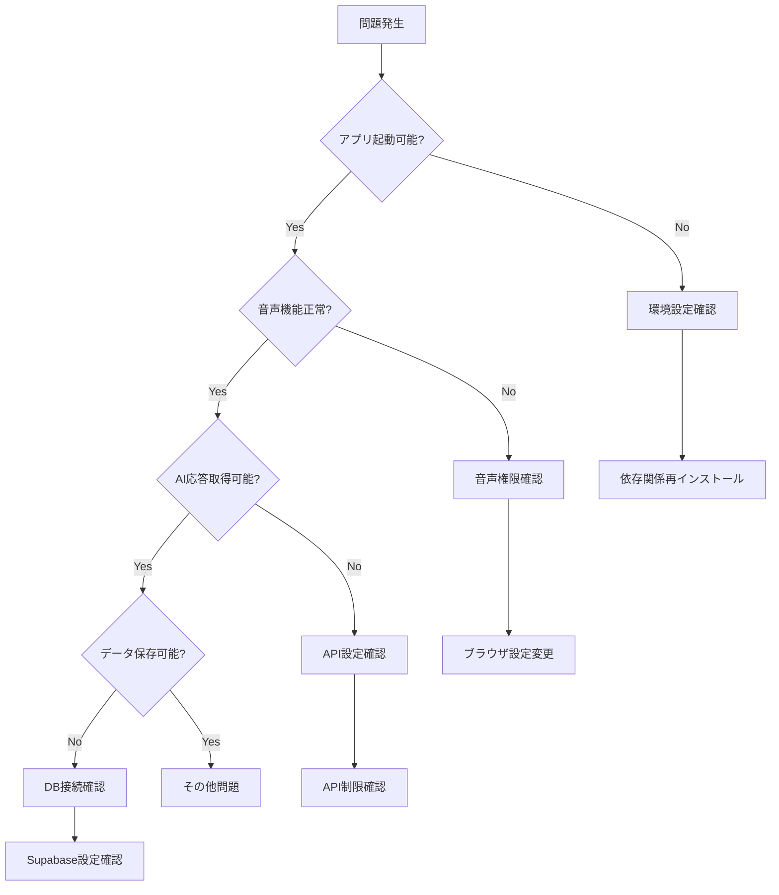

# トラブルシューティングガイド - WorldSpeakAI

## 🚨 緊急トラブル対応フローチャート



## 🔧 環境・セットアップ関連

### Node.js/npm関連エラー

#### 「Node.js version mismatch」エラー
**症状**: プロジェクト起動時にNode.jsバージョンエラー

**解決方法**:
```bash
# 現在のNode.jsバージョン確認
node --version

# 推奨バージョン（Node.js 18+）にアップデート
# nvm使用の場合
nvm install 18
nvm use 18

# パッケージ再インストール
rm -rf node_modules package-lock.json
npm install

# Expo CLIバージョン確認
npx expo --version
```

#### 「Metro bundler 内でビルドエラー」
**症状**: `npm start`実行時にbundlerエラー

**詳細診断と解決**:
```bash
# 1. キャッシュ完全クリア
npx expo start --clear
rm -rf node_modules/.cache

# 2. Expo診断ツール実行
npx expo doctor

# 3. TypeScript型チェック
npx tsc --noEmit

# 4. 問題が解決しない場合の強制リセット
rm -rf node_modules package-lock.json .expo
npm install
```

**Metro設定調整**:
```javascript
// metro.config.js カスタマイズ
const { getDefaultConfig } = require('expo/metro-config');

const config = getDefaultConfig(__dirname);

// 解決エラー対策
config.resolver.alias = {
  '@': './src',
  '@components': './src/components',
  '@services': './src/services'
};

// バンドル最適化
config.transformer.minifierConfig = {
  keep_fnames: true,
  mangle: {
    keep_fnames: true
  }
};

module.exports = config;
```

### 環境変数設定問題

#### 「Environment variables not loaded」
**症状**: 環境変数が認識されない

**詳細チェックリスト**:
```bash
# 1. ファイル存在確認
ls -la .env*

# 2. 環境変数構文確認
cat .env.local | grep -E '^[A-Z_]+=.*'

# 3. Expo環境変数プレフィックス確認
cat .env.local | grep EXPO_PUBLIC_

# 4. 本番/開発環境分離確認
echo "Current NODE_ENV: $NODE_ENV"
```

**正しい設定例**:
```bash
# .env.local （開発環境）
NODE_ENV=development
EXPO_PUBLIC_APP_VARIANT=development

# 必須設定
EXPO_PUBLIC_SUPABASE_URL=https://your-project.supabase.co
EXPO_PUBLIC_SUPABASE_ANON_KEY=eyJhbGciOiJIUzI1NiIsInR5cCI6IkpXVCJ9...
GEMINI_API_KEY=AIzaSy...

# デバッグ設定
EXPO_PUBLIC_ENABLE_DEVTOOLS=true
EXPO_PUBLIC_LOG_LEVEL=debug
```

## 🔐 認証・セキュリティ関連

### Supabase認証エラー

#### 「Authentication failed」複合診断
**症状**: ログイン・セッション管理の問題

**段階的診断手順**:
```typescript
// src/utils/authDiagnostics.ts
export class AuthDiagnostics {
  async runFullDiagnostics(): Promise<DiagnosticReport> {
    const report: DiagnosticReport = {
      connection: await this.testSupabaseConnection(),
      session: await this.testSessionManagement(),
      policies: await this.testRLSPolicies(),
      userProfile: await this.testUserProfile()
    };
    
    console.log('🔍 Auth Diagnostics Report:', report);
    return report;
  }
  
  private async testSupabaseConnection(): Promise<ConnectionStatus> {
    try {
      const { data, error } = await supabase.auth.getSession();
      return {
        status: error ? 'failed' : 'success',
        error: error?.message,
        responseTime: Date.now()
      };
    } catch (err) {
      return {
        status: 'failed',
        error: err.message,
        networkIssue: true
      };
    }
  }
  
  private async testSessionManagement(): Promise<SessionStatus> {
    const session = await supabase.auth.getSession();
    
    if (!session.data.session) {
      return { status: 'no_session' };
    }
    
    // トークン有効期限チェック
    const expiresAt = session.data.session.expires_at;
    const now = Math.floor(Date.now() / 1000);
    
    return {
      status: expiresAt > now ? 'valid' : 'expired',
      expiresAt,
      refreshable: !!session.data.session.refresh_token
    };
  }
}
```

#### セッション持続問題の解決
```typescript
// src/contexts/AuthContext.tsx 強化版
export const AuthProvider: React.FC<{children: React.ReactNode}> = ({ children }) => {
  const [session, setSession] = useState<Session | null>(null);
  const [loading, setLoading] = useState(true);
  const [authError, setAuthError] = useState<string | null>(null);
  
  useEffect(() => {
    let mounted = true;
    
    const initializeAuth = async () => {
      try {
        // セッション復元試行
        const { data: { session }, error } = await supabase.auth.getSession();
        
        if (error) {
          setAuthError(`Session restore failed: ${error.message}`);
          // トークンリフレッシュ試行
          const { data: refreshData, error: refreshError } = await supabase.auth.refreshSession();
          
          if (!refreshError && refreshData.session) {
            if (mounted) setSession(refreshData.session);
          }
        } else {
          if (mounted) setSession(session);
        }
      } catch (err) {
        if (mounted) setAuthError(`Auth initialization failed: ${err.message}`);
      } finally {
        if (mounted) setLoading(false);
      }
    };
    
    initializeAuth();
    
    // リアルタイム認証状態監視
    const { data: { subscription } } = supabase.auth.onAuthStateChange(
      async (event, session) => {
        if (!mounted) return;
        
        console.log('🔐 Auth state change:', event);
        
        switch (event) {
          case 'SIGNED_IN':
            setSession(session);
            setAuthError(null);
            break;
          case 'SIGNED_OUT':
            setSession(null);
            setAuthError(null);
            break;
          case 'TOKEN_REFRESHED':
            setSession(session);
            console.log('✅ Token refreshed successfully');
            break;
          case 'USER_UPDATED':
            setSession(session);
            break;
        }
        
        setLoading(false);
      }
    );
    
    return () => {
      mounted = false;
      subscription.unsubscribe();
    };
  }, []);
  
  // 省略...
};
```

### Row Level Security (RLS) エラー

#### 「Insufficient permissions」の診断
**症状**: データベースクエリが権限エラーで失敗

**詳細権限チェック**:
```sql
-- Supabaseダッシュボード > SQL Editorで実行

-- 1. RLS有効化状況確認
SELECT 
  schemaname,
  tablename,
  rowsecurity,
  pg_size_pretty(pg_total_relation_size(schemaname||'.'||tablename)) as size
FROM pg_tables 
WHERE schemaname = 'public'
ORDER BY rowsecurity DESC, tablename;

-- 2. ポリシー詳細確認
SELECT 
  pol.polname AS policy_name,
  pol.polrelid::regclass AS table_name,
  pol.polcmd AS command,
  pol.polqual AS qual,
  pol.polwithcheck AS with_check
FROM pg_policy pol
JOIN pg_class pc ON pol.polrelid = pc.oid
JOIN pg_namespace pn ON pc.relnamespace = pn.oid
WHERE pn.nspname = 'public';

-- 3. ユーザー権限テスト
-- 以下を現在のauth.uid()に置き換えて実行
SELECT 
  'profiles' as table_name,
  COUNT(*) as accessible_rows
FROM profiles 
WHERE auth.uid() = id

UNION ALL

SELECT 
  'conversations' as table_name,
  COUNT(*) as accessible_rows
FROM conversations 
WHERE auth.uid() = user_id;
```

## 🎤 音声認識・合成機能

### Web Speech API問題

#### ブラウザ互換性チェック
**症状**: 音声認識が開始されない

**詳細互換性診断**:
```typescript
// src/utils/speechDiagnostics.ts
export class SpeechDiagnostics {
  async performSpeechCheck(): Promise<SpeechSupportReport> {
    const report: SpeechSupportReport = {
      browser: this.getBrowserInfo(),
      speechRecognition: this.checkSpeechRecognition(),
      speechSynthesis: this.checkSpeechSynthesis(),
      mediaDevices: await this.checkMediaDevices(),
      permissions: await this.checkPermissions()
    };
    
    console.log('🎤 Speech Diagnostics:', report);
    return report;
  }
  
  private getBrowserInfo(): BrowserInfo {
    const userAgent = navigator.userAgent;
    return {
      name: this.detectBrowser(userAgent),
      version: this.extractVersion(userAgent),
      isSupported: this.isSpeechSupported(),
      platform: navigator.platform,
      isMobile: /iPhone|iPad|iPod|Android/i.test(userAgent)
    };
  }
  
  private checkSpeechRecognition(): SpeechRecognitionSupport {
    const SpeechRecognition = window.SpeechRecognition || window.webkitSpeechRecognition;
    
    if (!SpeechRecognition) {
      return {
        supported: false,
        reason: 'Speech Recognition API not available',
        alternatives: ['Use manual text input', 'Try Chrome/Safari browser']
      };
    }
    
    try {
      const recognition = new SpeechRecognition();
      return {
        supported: true,
        canConfiguration: true,
        maxAlternatives: recognition.maxAlternatives || 1
      };
    } catch (error) {
      return {
        supported: false,
        reason: `Initialization failed: ${error.message}`,
        alternatives: ['Check browser permissions', 'Restart browser']
      };
    }
  }
  
  private async checkMediaDevices(): Promise<MediaDevicesSupport> {
    if (!navigator.mediaDevices) {
      return {
        supported: false,
        reason: 'MediaDevices API not available'
      };
    }
    
    try {
      const devices = await navigator.mediaDevices.enumerateDevices();
      const audioInputs = devices.filter(device => device.kind === 'audioinput');
      
      return {
        supported: true,
        audioInputCount: audioInputs.length,
        devices: audioInputs.map(device => ({
          deviceId: device.deviceId,
          label: device.label || 'Unknown microphone'
        }))
      };
    } catch (error) {
      return {
        supported: false,
        reason: `Device enumeration failed: ${error.message}`
      };
    }
  }
}
```

#### マイク権限問題の解決
```typescript
// src/services/microphoneService.ts
class MicrophonePermissionManager {
  async requestPermission(): Promise<PermissionResult> {
    try {
      // 段階的権限要求
      const stream = await navigator.mediaDevices.getUserMedia({
        audio: {
          echoCancellation: true,
          noiseSuppression: true,
          autoGainControl: true,
          sampleRate: 44100
        }
      });
      
      // 権限取得成功 - ストリーム停止
      stream.getTracks().forEach(track => track.stop());
      
      return {
        granted: true,
        message: 'Microphone permission granted'
      };
    } catch (error) {
      return this.handlePermissionError(error);
    }
  }
  
  private handlePermissionError(error: any): PermissionResult {
    const errorMap: Record<string, string> = {
      'NotAllowedError': 'マイクの使用が拒否されています。ブラウザ設定から許可してください。',
      'NotFoundError': 'マイクデバイスが見つかりません。マイクが接続されているか確認してください。',
      'NotReadableError': 'マイクが他のアプリケーションで使用中です。',
      'OverconstrainedError': 'マイクの設定要求が満たせません。',
      'SecurityError': 'セキュリティ制限によりマイクアクセスが拒否されました。HTTPS接続が必要です。'
    };
    
    const message = errorMap[error.name] || `不明なエラー: ${error.message}`;
    
    return {
      granted: false,
      error: error.name,
      message,
      instructions: this.getInstructions(error.name)
    };
  }
  
  private getInstructions(errorName: string): string[] {
    const instructionMap: Record<string, string[]> = {
      'NotAllowedError': [
        'ブラウザのアドレスバー左側の錠前アイコンをクリック',
        'マイクの許可を「許可」に変更',
        'ページを再読み込み'
      ],
      'SecurityError': [
        'HTTPSで接続していることを確認',
        'ローカル開発の場合は localhost を使用'
      ]
    };
    
    return instructionMap[errorName] || ['ブラウザを再起動してお試しください'];
  }
}
```

### expo-speech関連問題

#### 音声合成エラーの診断
```typescript
// src/services/speechSynthesisService.ts
class SpeechSynthesisDiagnostics {
  async diagnoseIssues(): Promise<SynthesisDiagnosticReport> {
    const voices = await Speech.getAvailableVoicesAsync();
    
    return {
      voiceCount: voices.length,
      languageSupport: this.analyzeLanguageSupport(voices),
      qualityLevels: this.analyzeQualityLevels(voices),
      recommendations: this.generateRecommendations(voices)
    };
  }
  
  async testVoiceOutput(text: string, language: string): Promise<VoiceTestResult> {
    try {
      const bestVoice = await this.selectBestVoice(language);
      
      const startTime = Date.now();
      await Speech.speak(text, {
        language,
        voice: bestVoice?.identifier,
        rate: 1.0,
        pitch: 1.0
      });
      const endTime = Date.now();
      
      return {
        success: true,
        duration: endTime - startTime,
        voiceUsed: bestVoice,
        quality: this.assessVoiceQuality(bestVoice)
      };
    } catch (error) {
      return {
        success: false,
        error: error.message,
        suggestedFixes: [
          'Check device volume settings',
          'Verify language code format',
          'Try different voice selection'
        ]
      };
    }
  }
}
```

## 🤖 AI・API関連エラー

### Gemini API トラブルシューティング

#### API制限・エラーの詳細対応
```typescript
// src/services/geminiErrorHandler.ts
export class GeminiErrorHandler {
  async handleAPIError(error: any): Promise<ErrorResolution> {
    const errorCode = error.status || error.code;
    const errorMap = new Map<number | string, ErrorHandler>([
      [400, this.handleBadRequest],
      [401, this.handleUnauthorized],
      [403, this.handleForbidden],
      [429, this.handleRateLimit],
      [500, this.handleServerError],
      [503, this.handleServiceUnavailable]
    ]);
    
    const handler = errorMap.get(errorCode) || this.handleUnknownError;
    return await handler.call(this, error);
  }
  
  private async handleRateLimit(error: any): Promise<ErrorResolution> {
    // 指数バックオフ実装
    const retryAfter = error.headers?.['retry-after'] || 60;
    const backoffTime = Math.min(1000 * Math.pow(2, this.retryCount), 60000);
    
    return {
      canRetry: true,
      retryAfter: Math.max(retryAfter * 1000, backoffTime),
      fallbackResponse: this.generateFallbackResponse(),
      userMessage: `AI応答の制限に達しました。${retryAfter}秒後に再試行します。`,
      technicalDetails: {
        currentLimit: this.getCurrentRateLimit(),
        suggestedActions: [
          'Upgrade to paid plan for higher limits',
          'Reduce conversation frequency',
          'Wait for rate limit reset'
        ]
      }
    };
  }
  
  private generateFallbackResponse(): AIResponse {
    const fallbackMessages = {
      'ja': 'すみません、一時的に応答が困難です。しばらくお待ちください。',
      'en': 'I apologize, but I\'m temporarily unable to respond. Please wait a moment.',
      'zh': '抱歉，我暂时无法回应。请稍等片刻。',
      'ko': '죄송하지만 일시적으로 응답이 어렵습니다. 잠시 기다려주세요.',
      'es': 'Lo siento, temporalmente no puedo responder. Por favor espera un momento.'
    };
    
    return {
      text: fallbackMessages[this.currentLanguage] || fallbackMessages['en'],
      isFallback: true,
      confidence: 0.5,
      metadata: {
        reason: 'rate_limit_fallback',
        timestamp: new Date().toISOString()
      }
    };
  }
}
```

#### API パフォーマンス診断
```typescript
// src/utils/apiPerformance.ts
class APIPerformanceMonitor {
  async monitorAPIHealth(): Promise<APIHealthReport> {
    const tests = [
      this.testLatency(),
      this.testThroughput(),
      this.testErrorRate(),
      this.testRateLimit()
    ];
    
    const results = await Promise.allSettled(tests);
    
    return {
      timestamp: new Date().toISOString(),
      latency: this.extractResult(results[0]),
      throughput: this.extractResult(results[1]),
      errorRate: this.extractResult(results[2]),
      rateLimit: this.extractResult(results[3]),
      overallHealth: this.calculateOverallHealth(results),
      recommendations: this.generatePerformanceRecommendations(results)
    };
  }
  
  private async testLatency(): Promise<LatencyTest> {
    const startTime = performance.now();
    
    try {
      await this.geminiAPI.generateContent({
        contents: [{ parts: [{ text: 'Test latency' }] }]
      });
      
      const endTime = performance.now();
      const latency = endTime - startTime;
      
      return {
        latency,
        status: latency < 2000 ? 'good' : latency < 5000 ? 'fair' : 'poor',
        benchmark: 'Expected: <2000ms'
      };
    } catch (error) {
      return {
        latency: -1,
        status: 'error',
        error: error.message
      };
    }
  }
}
```

## 📱 プラットフォーム固有の問題

### iOS Safari特有の問題

#### 音声認識間欠停止
**症状**: iOS Safariで音声認識が予期せず停止

**解決方法**:
```typescript
// src/utils/iosSpeechFix.ts
class iOSSpeechRecognitionFix {
  private recognition: SpeechRecognition;
  private isIOS: boolean;
  private restartTimeout: NodeJS.Timeout;
  
  constructor() {
    this.isIOS = /iPad|iPhone|iPod/.test(navigator.userAgent);
  }
  
  startRecognition() {
    if (this.isIOS) {
      // iOS特有の設定
      this.recognition.continuous = false; // iOSでは連続認識を無効化
      this.recognition.interimResults = false; // 中間結果も無効化
      
      // 自動再起動メカニズム
      this.recognition.onend = () => {
        if (this.isListening) {
          this.restartTimeout = setTimeout(() => {
            this.recognition.start();
          }, 100);
        }
      };
    }
  }
  
  stopRecognition() {
    this.isListening = false;
    if (this.restartTimeout) {
      clearTimeout(this.restartTimeout);
    }
    this.recognition.stop();
  }
}
```

### Android Chrome特有の問題

#### バックグラウンド制限
```typescript
// src/utils/androidOptimizations.ts
class AndroidChromeOptimizations {
  handleVisibilityChange() {
    document.addEventListener('visibilitychange', () => {
      if (document.hidden) {
        // バックグラウンドに移行時の処理
        this.pauseNonEssentialServices();
      } else {
        // フォアグラウンド復帰時の処理
        this.resumeServices();
      }
    });
  }
  
  private pauseNonEssentialServices() {
    // 音声認識を一時停止（バッテリー節約）
    this.speechService.pause();
    
    // アニメーションを停止
    this.animationService.pause();
    
    // 不要なタイマーをクリア
    this.timerService.pauseAll();
  }
}
```

## 🗄️ データベース・ストレージ問題

### Supabase接続エラー

#### Connection Pool エラー
**症状**: "Connection pool exhausted"

**診断・解決**:
```typescript
// src/services/databaseDiagnostics.ts
class DatabaseHealthChecker {
  async checkConnectionHealth(): Promise<DatabaseHealthReport> {
    const checks = [
      this.testBasicConnection(),
      this.testQueryPerformance(),
      this.testRLSPolicies(),
      this.testStorageAccess()
    ];
    
    const results = await Promise.all(checks);
    
    return {
      connection: results[0],
      performance: results[1],
      security: results[2],
      storage: results[3],
      recommendations: this.generateDatabaseRecommendations(results)
    };
  }
  
  private async testQueryPerformance(): Promise<PerformanceTest> {
    const queries = [
      { name: 'profiles_select', query: () => supabase.from('profiles').select('id').limit(1) },
      { name: 'conversations_select', query: () => supabase.from('conversations').select('id').limit(10) },
      { name: 'messages_insert', query: () => this.testMessageInsert() }
    ];
    
    const results = await Promise.all(
      queries.map(async ({ name, query }) => {
        const startTime = performance.now();
        try {
          await query();
          return {
            name,
            duration: performance.now() - startTime,
            status: 'success'
          };
        } catch (error) {
          return {
            name,
            duration: -1,
            status: 'error',
            error: error.message
          };
        }
      })
    );
    
    return {
      queries: results,
      averageLatency: results.reduce((sum, r) => sum + (r.duration > 0 ? r.duration : 0), 0) / results.length,
      recommendation: this.getPerformanceRecommendation(results)
    };
  }
}
```

### ストレージ制限エラー

#### 音声ファイルアップロード失敗
```typescript
// src/services/audioStorageManager.ts
class AudioStorageManager {
  async uploadAudioWithRetry(
    audioBlob: Blob,
    conversationId: string,
    messageId: string,
    maxRetries: number = 3
  ): Promise<UploadResult> {
    let lastError: Error;
    
    for (let attempt = 1; attempt <= maxRetries; attempt++) {
      try {
        // ファイルサイズ最適化
        const optimizedBlob = await this.optimizeAudioBlob(audioBlob);
        
        const fileName = `${conversationId}/${messageId}_${Date.now()}.webm`;
        
        const { data, error } = await supabase.storage
          .from('audio')
          .upload(fileName, optimizedBlob, {
            contentType: 'audio/webm',
            cacheControl: '3600'
          });
        
        if (error) throw error;
        
        return {
          success: true,
          fileName,
          url: this.getPublicUrl(fileName),
          size: optimizedBlob.size,
          attempts: attempt
        };
      } catch (error) {
        lastError = error;
        console.warn(`Upload attempt ${attempt} failed:`, error);
        
        if (attempt < maxRetries) {
          await this.delay(1000 * attempt); // 指数バックオフ
        }
      }
    }
    
    return {
      success: false,
      error: lastError.message,
      attempts: maxRetries,
      fallbackAction: 'Store locally and retry later'
    };
  }
  
  private async optimizeAudioBlob(blob: Blob): Promise<Blob> {
    // 音声圧縮処理（Web Audio API使用）
    const arrayBuffer = await blob.arrayBuffer();
    const audioContext = new AudioContext();
    const audioBuffer = await audioContext.decodeAudioData(arrayBuffer);
    
    // 品質を下げてファイルサイズ削減
    const optimizedBuffer = this.compressAudio(audioBuffer);
    
    return this.audioBufferToBlob(optimizedBuffer);
  }
}
```

## 🎯 性能・最適化問題

### メモリリーク診断

```typescript
// src/utils/memoryDiagnostics.ts
class MemoryLeakDetector {
  private initialMemory: number;
  private checkInterval: NodeJS.Timeout;
  
  startMonitoring() {
    if (performance.memory) {
      this.initialMemory = performance.memory.usedJSHeapSize;
      
      this.checkInterval = setInterval(() => {
        this.checkMemoryUsage();
      }, 30000); // 30秒ごとにチェック
    }
  }
  
  private checkMemoryUsage() {
    const currentMemory = performance.memory.usedJSHeapSize;
    const memoryGrowth = currentMemory - this.initialMemory;
    const memoryGrowthMB = memoryGrowth / 1024 / 1024;
    
    if (memoryGrowthMB > 50) { // 50MB以上増加
      console.warn('⚠️ Potential memory leak detected:', {
        initialMemory: this.initialMemory / 1024 / 1024,
        currentMemory: currentMemory / 1024 / 1024,
        growth: memoryGrowthMB
      });
      
      this.suggestMemoryOptimizations();
    }
  }
  
  private suggestMemoryOptimizations() {
    console.log('💡 Memory optimization suggestions:');
    console.log('1. Clear conversation history older than 1 hour');
    console.log('2. Release audio resources after playback');
    console.log('3. Unsubscribe from unused event listeners');
    console.log('4. Clear cached API responses');
  }
}
```

## 🧪 自動診断ツール

### 総合ヘルスチェック

```typescript
// src/utils/appDiagnostics.ts
export class AppDiagnostics {
  async runComprehensiveDiagnostics(): Promise<ComprehensiveDiagnosticReport> {
    console.log('🔍 Running comprehensive app diagnostics...');
    
    const diagnostics = await Promise.allSettled([
      new AuthDiagnostics().runFullDiagnostics(),
      new SpeechDiagnostics().performSpeechCheck(),
      new DatabaseHealthChecker().checkConnectionHealth(),
      new APIPerformanceMonitor().monitorAPIHealth(),
      new MemoryLeakDetector().checkCurrentUsage()
    ]);
    
    const report: ComprehensiveDiagnosticReport = {
      timestamp: new Date().toISOString(),
      overall: this.calculateOverallHealth(diagnostics),
      auth: this.extractResult(diagnostics[0]),
      speech: this.extractResult(diagnostics[1]),
      database: this.extractResult(diagnostics[2]),
      api: this.extractResult(diagnostics[3]),
      memory: this.extractResult(diagnostics[4]),
      recommendations: this.generateRecommendations(diagnostics),
      nextSteps: this.getNextSteps(diagnostics)
    };
    
    // 診断結果をローカルストレージに保存（デバッグ用）
    localStorage.setItem('lastDiagnosticReport', JSON.stringify(report, null, 2));
    
    return report;
  }
}

// 使用例
const diagnostics = new AppDiagnostics();
diagnostics.runComprehensiveDiagnostics().then(report => {
  console.log('📊 Diagnostic Report:', report);
});
```

## 📞 サポート・コミュニティ

### 問題報告テンプレート

効率的なサポートのため、以下の情報を含めてください：

```markdown
## 🐛 バグレポートテンプレート

### 環境情報
- **OS**: [例: macOS 14.1, Windows 11, Android 13]
- **ブラウザ**: [例: Chrome 119.0, Safari 17.1]
- **デバイス**: [例: iPhone 15 Pro, MacBook Pro M2]
- **アプリバージョン**: [package.jsonから確認]

### 問題の説明
**症状**: [具体的な症状を記述]
**期待される動作**: [正常時の期待動作]
**実際の動作**: [実際に起きている問題]

### 再現手順
1. [ステップ1]
2. [ステップ2]
3. [問題発生]

### エラーメッセージ
```javascript
// 開発者ツールのConsoleエラー
[エラーメッセージをここに貼り付け]
```

### 診断情報
```javascript
// ブラウザ開発者ツールで実行
new AppDiagnostics().runComprehensiveDiagnostics()
```

### 追加情報
- **頻度**: [毎回/時々/一度だけ]
- **影響範囲**: [機能が全く使えない/一部制限あり/軽微]
- **回避策**: [一時的な回避策があれば]
```

### コミュニティリソース

- **GitHub Issues**: [https://github.com/hayate-business/WorldSpeakAI/issues](https://github.com/hayate-business/WorldSpeakAI/issues)
- **Discussions**: [技術的な質問・機能提案](https://github.com/hayate-business/WorldSpeakAI/discussions)
- **Documentation**: [開発者向けドキュメント](./README.md)

---

**🔧 このトラブルシューティングガイドにより、claude codeは効率的に問題を診断・解決し、WorldSpeakAIの安定稼働を実現できます！**

#### セッションが維持されない
**症状**: ログイン後、アプリを再起動するとログアウトされる

**解決方法**:
```javascript
// AuthContext.tsxで自動ログイン実装を確認
useEffect(() => {
  supabase.auth.getSession().then(({ data: { session } }) => {
    setSession(session);
    setUser(session?.user ?? null);
  });

  const { data: { subscription } } = supabase.auth.onAuthStateChange((_event, session) => {
    setSession(session);
    setUser(session?.user ?? null);
  });

  return () => subscription.unsubscribe();
}, []);
```

### 音声認識関連

#### "Speech Recognition Not Available"エラー
**症状**: マイクボタンをタップしても音声認識が開始されない

**原因と解決方法**:

1. **ブラウザ互換性**
   | ブラウザ | サポート状況 | 備考 |
   |----------|------------|------|
   | Chrome | ✅ 完全対応 | 推奨 |
   | Safari | ✅ 対応 | iOS 14.5+ |
   | Firefox | ❌ 非対応 | 代替手段必要 |
   | Edge | ✅ 対応 | Chromium版 |

2. **HTTPS接続確認**
   ```javascript
   // HTTPSでアクセスしているか確認
   if (location.protocol !== 'https:' && location.hostname !== 'localhost') {
     alert('HTTPSで接続してください');
   }
   ```

3. **モバイルブラウザ対応**
   ```javascript
   // モバイル判定と対応メッセージ
   const isMobile = /iPhone|iPad|iPod|Android/i.test(navigator.userAgent);
   if (isMobile && !window.SpeechRecognition && !window.webkitSpeechRecognition) {
     alert('ChromeまたはSafariブラウザをご利用ください');
   }
   ```

#### マイク権限エラー
**症状**: "Microphone access was denied"エラーが表示される

**解決方法**:

1. **ブラウザ設定確認**
   - Chrome: `chrome://settings/content/microphone`
   - Safari: 設定 > Safari > Webサイト > マイク
   - Edge: `edge://settings/content/microphone`

2. **権限リセット**
   ```javascript
   // 権限を再要求
   navigator.mediaDevices.getUserMedia({ audio: true })
     .then(stream => {
       stream.getTracks().forEach(track => track.stop());
       console.log('マイク権限取得成功');
     })
     .catch(err => {
       console.error('マイク権限エラー:', err);
     });
   ```

### AI応答関連

#### Gemini APIエラー
**症状**: "Failed to process your message"エラーが表示される

**原因と解決方法**:

1. **APIキー確認**
   ```bash
   # 環境変数確認
   echo $GEMINI_API_KEY
   
   # APIキーテスト
   curl -X POST https://generativelanguage.googleapis.com/v1beta/models/gemini-1.5-flash:generateContent \
     -H "x-goog-api-key: YOUR_API_KEY" \
     -H "Content-Type: application/json" \
     -d '{"contents":[{"parts":[{"text":"Hello"}]}]}'
   ```

2. **レート制限対策**
   ```javascript
   // リトライロジック実装
   const sendWithRetry = async (prompt, retries = 3) => {
     for (let i = 0; i < retries; i++) {
       try {
         return await sendMessageToGemini(prompt);
       } catch (error) {
         if (i === retries - 1) throw error;
         await new Promise(resolve => setTimeout(resolve, 1000 * Math.pow(2, i)));
       }
     }
   };
   ```

3. **エラーコード別対処**
   | コード | 原因 | 対処法 |
   |--------|------|--------|
   | 401 | APIキー無効 | キー再生成 |
   | 429 | レート制限 | 待機後リトライ |
   | 500 | サーバーエラー | 時間を置いて再試行 |

### パフォーマンス問題

#### アプリの動作が重い
**症状**: 会話画面でレスポンスが遅い

**解決方法**:

1. **メッセージ数制限**
   ```javascript
   // 表示メッセージ数を制限
   const displayMessages = messages.slice(-50);
   ```

2. **メモリリーク確認**
   ```javascript
   // クリーンアップ処理確認
   useEffect(() => {
     return () => {
       // リスナー解除
       if (recognition) recognition.stop();
       // タイマークリア
       clearTimeout(timeoutId);
     };
   }, []);
   ```

### ビルド・デプロイ関連

#### Metro bundlerエラー
**症状**: "Metro has encountered an error"

**解決方法**:
```bash
# キャッシュクリア
npx expo start -c

# またはMetroキャッシュ削除
rm -rf node_modules/.cache/metro
```

#### TypeScriptエラー
**症状**: ビルド時に型エラーが発生

**解決方法**:
```bash
# 型定義更新
npm install --save-dev @types/react@latest @types/react-native@latest

# TypeScript設定確認
npx tsc --noEmit
```

### データベース関連

#### Supabaseクエリエラー
**症状**: データ取得・保存ができない

**解決方法**:

1. **RLSポリシー確認**
   ```sql
   -- ポリシー一覧確認
   SELECT * FROM pg_policies;
   
   -- RLS有効化確認
   SELECT tablename, rowsecurity 
   FROM pg_tables 
   WHERE schemaname = 'public';
   ```

2. **権限確認**
   ```javascript
   // 認証状態確認
   const { data: { user } } = await supabase.auth.getUser();
   console.log('Current user:', user);
   ```

## 🚨 エラーメッセージ一覧

### 日本語エラーメッセージ対応表

| エラーメッセージ | 原因 | 対処法 |
|----------------|------|--------|
| "ネットワークエラーが発生しました" | インターネット接続問題 | 接続確認、リトライ |
| "認証に失敗しました" | セッション期限切れ | 再ログイン |
| "音声認識を開始できません" | マイク権限なし | 権限設定確認 |
| "AIからの応答がありません" | API制限/エラー | 時間を置いて再試行 |
| "データの保存に失敗しました" | DB接続エラー | ネットワーク確認 |

## 🐛 デバッグ方法

### ブラウザ開発者ツール

1. **Console確認**
   ```javascript
   // デバッグ情報出力
   console.log('Current state:', { isRecording, messages, error });
   ```

2. **Network監視**
   - APIリクエスト確認
   - レスポンス内容確認
   - エラーステータス確認

3. **Application Storage**
   - LocalStorage確認
   - SessionStorage確認
   - IndexedDB確認

### React Native Debugger

1. **Expo Dev Tools**
   ```bash
   # デバッグモード起動
   expo start --dev-client
   ```

2. **Console.log確認**
   ```javascript
   // アプリ内デバッグ表示
   {__DEV__ && (
     <View style={styles.debugContainer}>
       <Text style={styles.debugText}>{debugInfo}</Text>
     </View>
   )}
   ```

## 📝 ログ収集

### エラーログ収集
```javascript
// グローバルエラーハンドラー
window.addEventListener('error', (event) => {
  console.error('Global error:', {
    message: event.message,
    source: event.filename,
    line: event.lineno,
    column: event.colno,
    error: event.error
  });
});

// Promiseエラーハンドラー
window.addEventListener('unhandledrejection', (event) => {
  console.error('Unhandled promise rejection:', event.reason);
});
```

### パフォーマンスログ
```javascript
// 処理時間測定
const startTime = performance.now();
// 処理実行
const endTime = performance.now();
console.log(`処理時間: ${endTime - startTime}ms`);
```

## 🆘 サポート連絡先

解決しない場合の連絡先:
1. **GitHub Issues**: [https://github.com/hayate-business/WorldSpeakAI/issues](https://github.com/hayate-business/WorldSpeakAI/issues)
2. **メールサポート**: support@worldspeak.ai（今後開設予定）
3. **コミュニティフォーラム**: 準備中

問題報告時に含めるべき情報:
- エラーメッセージ全文
- 使用環境（OS、ブラウザ、バージョン）
- 再現手順
- スクリーンショット（可能であれば）
- コンソールログ