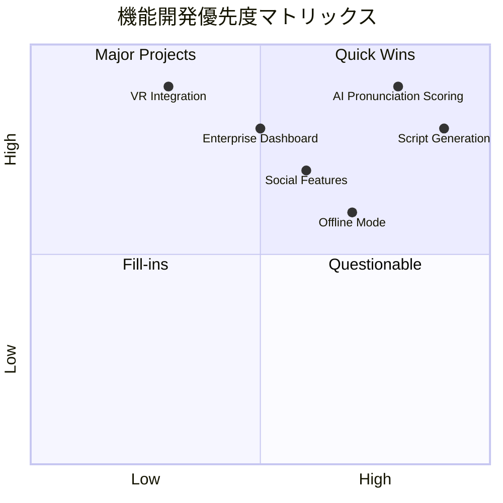
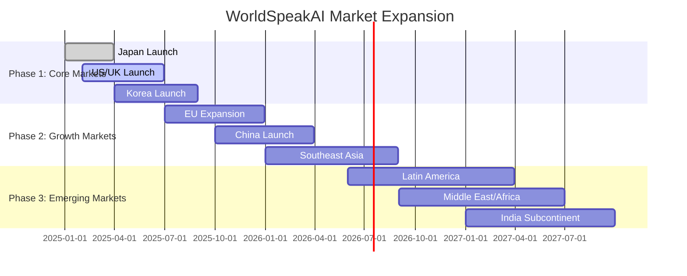

# 開発ロードマップ - WorldSpeakAI

## 🎯 プロダクトビジョン

**「世界中の人々が言語の壁を越えて自由にコミュニケーションできる世界」の実現**

WorldSpeakAIは革新的な多言語AI会話学習プラットフォームとして、従来の語学学習の限界を突破し、実践的なコミュニケーション能力の習得を可能にします。

### コアミッション
1. **アクセシビリティ**: 誰もがいつでもどこでも高品質な言語学習を
2. **実践性**: リアルな会話体験による実用的スキル習得
3. **効率性**: AI技術による個別最適化学習
4. **継続性**: ゲーミフィケーションによる長期モチベーション維持

## 📊 開発戦略マトリックス



## 🏗️ 技術基盤強化（Phase 1: 2025 Q1）✅

### 完了済みコア機能
- ✅ **多言語AI会話エンジン**
  - Gemini AI Pro統合による自然な会話生成
  - 100+言語対応の音声認識・合成
  - リアルタイム音声処理パイプライン

- ✅ **革新的台本ガイダンスシステム**
  - 初心者向け会話台本自動生成
  - 動的難易度調整機能
  - 文化的コンテキスト考慮

- ✅ **公平なマイク時間管理**
  - 実際の発話時間のみカウント
  - 無音時間除外アルゴリズム
  - プラン別使用量制限

- ✅ **堅牢な認証・プロファイル管理**
  - Supabase Auth完全統合
  - 多言語学習プロファイル
  - 詳細学習進捗追跡

- ✅ **クロスプラットフォーム対応**
  - PWA最適化Web版
  - React Native/Expoモバイルアプリ
  - レスポンシブUI/UX設計

## 🎯 高度AI機能実装（Phase 2: 2025 Q2）🚧

### 発音分析・評価システム
```typescript
interface PronunciationAnalysisRoadmap {
  // Q2 2025: 基本実装
  phoneticAnalysis: {
    implementation: 'Web Audio API + ML Model';
    accuracy: '85%+ target';
    languages: ['en', 'ja', 'zh', 'ko', 'es'];
    realTimeProcessing: boolean;
  };
  
  // Q3 2025: 高度化
  advancedScoring: {
    prosodyAnalysis: boolean;    // 韻律分析
    emotionDetection: boolean;   // 感情認識
    accentCoaching: boolean;     // アクセント指導
  };
  
  // Q4 2025: パーソナライゼーション
  adaptiveFeedback: {
    learnerProfile: boolean;     // 学習者プロファイル
    customizedHints: boolean;    // カスタマイズヒント
    progressPrediction: boolean; // 進歩予測
  };
}
```

**実装計画**:
- **2025年3月**: 音素レベル分析エンジン
- **2025年4月**: リアルタイムフィードバックUI
- **2025年5月**: 多言語対応拡張
- **2025年6月**: ベータテスト・調整

### 専門分野特化システム
```typescript
interface SpecializationExpansion {
  // ビジネス英語強化
  businessEnglish: {
    scenarios: ['meetings', 'presentations', 'negotiations', 'networking'];
    industries: ['tech', 'finance', 'healthcare', 'education'];
    certificationPrep: ['TOEIC', 'TOEFL', 'IELTS'];
  };
  
  // 医療・法律特化
  professionalFields: {
    medical: ['patient_consultation', 'medical_reports', 'case_studies'];
    legal: ['contract_review', 'court_proceedings', 'client_meetings'];
    engineering: ['technical_documentation', 'project_meetings'];
  };
  
  // 文化的コンテキスト
  culturalAdaptation: {
    businessEtiquette: ['japanese', 'american', 'european'];
    socialNorms: ['formal', 'informal', 'regional_differences'];
    idiomsPhrases: ['native_expressions', 'cultural_references'];
  };
}
```

### 次世代台本生成AI
```typescript
interface NextGenScriptGeneration {
  // 動的台本生成
  dynamicGeneration: {
    realTimeAdaptation: boolean;    // リアルタイム適応
    contextAwareness: boolean;      // コンテキスト認識
    difficultyScaling: boolean;     // 難易度調整
    personalizedContent: boolean;   // 個人化コンテンツ
  };
  
  // マルチモーダル対応
  multimodalSupport: {
    imageBasedConversations: boolean; // 画像ベース会話
    situationalDialogues: boolean;    // 状況対話
    rolePlayingScenarios: boolean;    // ロールプレイ
  };
  
  // ゲーミフィケーション統合
  gamificationIntegration: {
    questBasedLearning: boolean;      // クエスト学習
    storyDrivenScenarios: boolean;    // ストーリー駆動
    characterDevelopment: boolean;    // キャラクター育成
  };
}
```

## 🤖 AI個別指導コーチング（Phase 3: 2025 Q3）🔮

### パーソナライズドAIコーチ
```typescript
interface AICoachingSystem {
  // 学習者分析エンジン
  learnerAnalytics: {
    strengthWeaknessMapping: boolean;   // 強み弱み分析
    learningStyleDetection: boolean;    // 学習スタイル検出
    motivationProfiling: boolean;       // モチベーション分析
    progressPrediction: boolean;        // 進捗予測
  };
  
  // 適応的カリキュラム
  adaptiveCurriculum: {
    personalizedLessonPlans: boolean;   // 個別レッスンプラン
    difficultyCurveOptimization: boolean; // 難易度曲線最適化
    timeOptimizedScheduling: boolean;   // 時間最適化スケジュール
    retentionMaximization: boolean;     // 記憶定着最大化
  };
  
  // マルチエージェントAI
  multiAgentArchitecture: {
    conversationAgent: 'Natural dialogue partner';
    tutorAgent: 'Explanation and correction';
    motivationAgent: 'Encouragement and goal setting';
    analyticsAgent: 'Progress tracking and insights';
  };
}
```

**実装マイルストーン**:
- **2025年7月**: 基本学習者分析システム
- **2025年8月**: 適応的コンテンツ配信
- **2025年9月**: マルチエージェントAI統合

### 高度な学習分析ダッシュボード
```typescript
interface AdvancedAnalyticsDashboard {
  // 包括的進捗トラッキング
  comprehensiveTracking: {
    skillProgression: Map<LanguageSkill, ProgressMetric>;
    timeInvestmentROI: EfficiencyMetric;
    confidenceGrowth: PsychologicalMetric;
    communicationReadiness: PracticalAssessment;
  };
  
  // 予測的インサイト
  predictiveInsights: {
    masteryTimeEstimation: TimelinePredictor;
    plateauIdentification: LearningObstacleDetector;
    optimalSessionTiming: ScheduleOptimizer;
    burnoutPrevention: WellnessMonitor;
  };
  
  // 比較分析
  benchmarkingAnalysis: {
    peerComparison: CohortAnalytics;
    globalAverages: PopulationMetrics;
    industryStandards: ProfessionalBenchmarks;
  };
}
```

## 🌐 ソーシャル学習エコシステム（Phase 4: 2025 Q4）👥

### 言語交換マッチングプラットフォーム
```typescript
interface LanguageExchangePlatform {
  // スマートマッチングアルゴリズム
  intelligentMatching: {
    languagePairMatching: boolean;      // 言語ペア一致
    skillLevelAlignment: boolean;       // スキルレベル調整
    timeZoneOptimization: boolean;      // タイムゾーン最適化
    personalityCompatibility: boolean;  // 性格相性
    interestBasedPairing: boolean;      // 興味ベースペア
  };
  
  // バーチャル学習環境
  virtualLearningSpaces: {
    immersiveConversationRooms: boolean; // 没入型会話ルーム
    topicBasedChannels: boolean;         // トピック別チャンネル
    professionalNetworking: boolean;     // プロフェッショナルネットワーク
    culturalExchangeEvents: boolean;     // 文化交流イベント
  };
  
  // コミュニティ機能
  communityFeatures: {
    studyGroups: boolean;                // 学習グループ
    languageChallenges: boolean;         // 言語チャレンジ
    peerReview: boolean;                 // ピアレビュー
    mentorshipPrograms: boolean;         // メンターシップ
  };
}
```

### グローバル学習コミュニティ
```typescript
interface GlobalLearningCommunity {
  // 多様な学習コンテンツ
  diverseContent: {
    userGeneratedLessons: boolean;       // ユーザー生成レッスン
    culturalStorytelling: boolean;       // 文化的ストーリーテリング
    newsDiscussions: boolean;            // ニュース議論
    businessCaseStudies: boolean;        // ビジネスケーススタディ
  };
  
  // 評価・認定システム
  credentialingSystem: {
    skillBadges: boolean;                // スキルバッジ
    peerEndorsements: boolean;           // ピア推薦
    professionalCertificates: boolean;   // プロフェッショナル証明書
    portfolioBuilding: boolean;          // ポートフォリオ構築
  };
  
  // グローバルイベント
  globalEvents: {
    languageFestivals: boolean;          // 言語フェスティバル
    culturalCelebrations: boolean;       // 文化的祝祭
    professionalConferences: boolean;    // プロフェッショナル会議
    learningCompetitions: boolean;       // 学習競技
  };
}
```

## 🏢 エンタープライズ・教育機関向け（Phase 5: 2026）

### 企業研修プラットフォーム
```typescript
interface EnterpriseLearningPlatform {
  // 組織管理機能
  organizationManagement: {
    multiTenantArchitecture: boolean;    // マルチテナント
    roleBasedAccess: boolean;            // ロールベースアクセス
    departmentManagement: boolean;       // 部門管理
    skillGapAnalysis: boolean;           // スキルギャップ分析
  };
  
  // カスタマイズ機能
  customizationFeatures: {
    brandedInterfaces: boolean;          // ブランド化インターフェース
    companySpecificScenarios: boolean;   // 企業特化シナリオ
    industryTerminology: boolean;        // 業界専門用語
    complianceTracking: boolean;         // コンプライアンス追跡
  };
  
  // 統合・分析
  integrationAnalytics: {
    hrSystemIntegration: boolean;        // HR システム統合
    learningManagementSystem: boolean;   // LMS統合
    performanceMetrics: boolean;         // パフォーマンス指標
    roiMeasurement: boolean;             // ROI測定
  };
}
```

### 教育機関向けソリューション
```typescript
interface EducationalInstitutionSolution {
  // 学術統合
  academicIntegration: {
    curriculumAlignment: boolean;        // カリキュラム整合
    gradingSystem: boolean;              // 成績システム
    assessmentTools: boolean;            // 評価ツール
    learningOutcomes: boolean;           // 学習成果
  };
  
  // 教師向けツール
  educatorTools: {
    classroomManagement: boolean;        // 教室管理
    progressMonitoring: boolean;         // 進捗モニタリング
    lessonPlanIntegration: boolean;      // レッスンプラン統合
    parentCommunication: boolean;        // 保護者連絡
  };
  
  // 研究・開発
  researchDevelopment: {
    learningAnalyticsResearch: boolean;  // 学習分析研究
    languageAcquisitionStudies: boolean; // 言語習得研究
    pedagogicalInnovation: boolean;      // 教育学革新
    globalPartnership: boolean;          // グローバルパートナーシップ
  };
}
```

## 🚀 次世代技術統合（Phase 6: 2026-2027）

### 没入型学習体験
```typescript
interface ImmersiveLearningExperience {
  // VR/AR統合
  virtualRealityIntegration: {
    virtualClassrooms: boolean;          // バーチャル教室
    immersiveScenarios: boolean;         // 没入型シナリオ
    culturalVirtualTours: boolean;       // 文化的バーチャルツアー
    spatialAudioConversations: boolean;  // 空間音響会話
  };
  
  // 拡張現実機能
  augmentedRealityFeatures: {
    realTimeTranslation: boolean;        // リアルタイム翻訳
    contextualVocabulary: boolean;       // コンテキスト語彙
    objectRecognitionDialogue: boolean;  // 物体認識対話
    navigationAssistance: boolean;       // ナビゲーション支援
  };
  
  // 混合現実
  mixedRealityCapabilities: {
    holographicTutors: boolean;          // ホログラフィック講師
    realWorldPractice: boolean;          // 現実世界練習
    collaborativeSpaces: boolean;        // 協働空間
    gestureRecognition: boolean;         // ジェスチャー認識
  };
}
```

### AI技術最先端統合
```typescript
interface CuttingEdgeAIIntegration {
  // 脳科学応用
  neuroscientificApplications: {
    cognitiveLoadOptimization: boolean;  // 認知負荷最適化
    memoryConsolidationTiming: boolean;  // 記憶固化タイミング
    attentionStateMonitoring: boolean;   // 注意状態モニタリング
    personalizedNeuroplasticity: boolean; // 個人化神経可塑性
  };
  
  // 量子機械学習
  quantumMachineLearning: {
    quantumLanguageModels: boolean;      // 量子言語モデル
    superpositionLearning: boolean;      // 重ね合わせ学習
    entanglementCommunication: boolean;  // もつれ通信
  };
  
  // 意識AI統合
  consciousAIIntegration: {
    emotionalIntelligence: boolean;      // 感情知能
    empathySimulation: boolean;          // 共感シミュレーション
    creativeConversation: boolean;       // 創造的会話
    philosophicalDialogue: boolean;      // 哲学的対話
  };
}
```

## 📈 ビジネス成長戦略

### 市場展開ロードマップ


### 収益モデル多様化
```typescript
interface RevenueModelDiversification {
  // サブスクリプション層
  subscriptionTiers: {
    freemium: {
      monthlyMinutes: 60;
      features: ['basic_conversations', 'simple_scripts'];
      target: 'Individual learners trying the platform';
    };
    standard: {
      monthlyMinutes: 900;
      features: ['advanced_AI', 'pronunciation_analysis', 'progress_tracking'];
      price: '$6.99/month';
      target: 'Serious individual learners';
    };
    premium: {
      monthlyMinutes: 3000;
      features: ['unlimited_features', 'priority_support', 'offline_mode'];
      price: '$19.99/month';
      target: 'Power users and professionals';
    };
    enterprise: {
      features: ['unlimited_users', 'custom_branding', 'analytics_dashboard'];
      pricing: 'Custom pricing based on usage';
      target: 'Corporations and institutions';
    };
  };
  
  // 追加収益源
  additionalRevenue: {
    professionalCertifications: '$99-299 per certification';
    oneOnOneTutoring: '$30-80 per hour with native speakers';
    customContentCreation: 'Enterprise-specific scenarios';
    apiLicensing: 'Third-party integration licensing';
    hardwarePartnerships: 'AR/VR device bundling';
  };
}
```

## 🎯 成功指標・KPI

### 2025年度目標
| 指標 | Q1目標 | Q2目標 | Q3目標 | Q4目標 |
|------|--------|--------|--------|--------|
| **ユーザー成長** |
| MAU | 5K | 25K | 75K | 150K |
| 有料会員 | 500 | 2.5K | 7.5K | 15K |
| 企業顧客 | 5 | 15 | 35 | 50 |
| **エンゲージメント** |
| 平均セッション時間 | 12分 | 15分 | 18分 | 20分 |
| 月間継続率 | 35% | 45% | 55% | 60% |
| NPS | 40 | 50 | 60 | 70 |
| **技術指標** |
| 音声認識精度 | 85% | 90% | 93% | 95% |
| AI応答品質 | 80% | 85% | 90% | 92% |
| アプリ起動時間 | <3秒 | <2.5秒 | <2秒 | <1.5秒 |

### 2026-2027年長期目標
```typescript
interface LongTermGoals {
  userMetrics: {
    globalMAU: '1M+ by end of 2026';
    paidUsers: '100K+ by end of 2026';
    enterpriseClients: '500+ by end of 2026';
    languageCoverage: '50+ languages by 2027';
  };
  
  businessMetrics: {
    annualRecurringRevenue: '$50M+ by 2026';
    profitability: 'Achieve profitability by Q3 2026';
    marketShare: 'Top 3 in AI language learning by 2027';
    globalPresence: '15+ countries by 2027';
  };
  
  technologyMetrics: {
    aiAccuracy: '98%+ conversational AI by 2027';
    realTimeProcessing: '<100ms response time';
    platformReliability: '99.9% uptime';
    securityCompliance: 'SOC2, ISO27001 certified';
  };
}
```

## 🤝 戦略的パートナーシップ

### 技術パートナーシップ
```typescript
interface TechnologyPartnerships {
  // AI/ML パートナー
  aiMLPartners: {
    googleCloud: 'Gemini AI integration and cloud infrastructure';
    openAI: 'Complementary AI models for specialized tasks';
    anthropic: 'Advanced reasoning and safety research';
    stability: 'Multimodal content generation';
  };
  
  // 音声技術パートナー
  speechTechPartners: {
    elevenlabs: 'Premium voice synthesis';
    assemblyAI: 'Advanced speech recognition';
    deepgram: 'Real-time audio processing';
    speechly: 'Voice interface optimization';
  };
  
  // インフラパートナー
  infrastructurePartners: {
    vercel: 'Edge computing and global CDN';
    supabase: 'Backend-as-a-Service and real-time features';
    cloudflare: 'Security and performance optimization';
    aws: 'Enterprise-grade infrastructure';
  };
}
```

### 教育・業界パートナーシップ
```typescript
interface EducationIndustryPartnerships {
  // 教育機関
  educationalInstitutions: {
    universities: 'Research collaboration and pilot programs';
    languageSchools: 'Curriculum integration and teacher training';
    corporateTraining: 'Professional development partnerships';
    governmentPrograms: 'Public sector language learning initiatives';
  };
  
  // コンテンツパートナー
  contentPartners: {
    publishers: 'Textbook and curriculum integration';
    mediaCompanies: 'News and entertainment content';
    culturalOrganizations: 'Authentic cultural content';
    professionalBodies: 'Industry-specific content development';
  };
  
  // 流通パートナー
  distributionChannels: {
    appStores: 'Featured app placements';
    educationResellers: 'B2B sales channel partnerships';
    systemIntegrators: 'Enterprise implementation partners';
    consultingFirms: 'Change management and adoption services';
  };
}
```

## 🔬 研究開発投資

### R&D重点領域
```typescript
interface RDInvestmentAreas {
  // コア技術研究 (40% of R&D budget)
  coreTechnologyResearch: {
    nextGenAI: 'Advanced language models and reasoning';
    speechProcessing: 'Real-time, high-fidelity voice processing';
    learningScience: 'Cognitive science and pedagogy research';
    userExperience: 'Human-computer interaction optimization';
  };
  
  // 新興技術探索 (30% of R&D budget)
  emergingTechnologies: {
    brainComputerInterfaces: 'Direct neural language learning';
    quantumComputing: 'Quantum-enhanced language processing';
    holographicDisplays: 'Next-gen AR/VR experiences';
    bioMetricFeedback: 'Physiological learning state monitoring';
  };
  
  // 応用研究 (30% of R&D budget)
  appliedResearch: {
    personalizationAlgorithms: 'Individual learning optimization';
    culturalIntelligence: 'Cross-cultural communication enhancement';
    accessibilityTech: 'Inclusive design for all learners';
    sustainabilityTech: 'Green computing and carbon neutrality';
  };
}
```

### オープンソース貢献戦略
```typescript
interface OpenSourceStrategy {
  // コミュニティ貢献
  communityContributions: {
    speechProcessingLibraries: 'Open-source speech tools';
    languageLearningDatasets: 'Anonymized learning data';
    aiTrainingMethodologies: 'Pedagogical AI techniques';
    accessibilityFrameworks: 'Inclusive learning tools';
  };
  
  // 研究発表
  researchPublication: {
    academicPapers: 'Peer-reviewed research publication';
    conferencePresentation: 'Industry and academic conference speaking';
    standardsContribution: 'Industry standard development participation';
    thoughtLeadership: 'Technology and education trend analysis';
  };
}
```

この包括的なロードマップにより、claude codeは以下を実現できます：

1. **明確な開発優先順位の理解**
2. **技術実装の具体的なマイルストーン**
3. **ビジネス戦略との技術的整合性**
4. **長期的な技術負債回避**
5. **イノベーション機会の特定**

---

**🚀 このロードマップは living document として、市場フィードバックと技術進歩に応じて四半期ごとに更新されます。最新情報は GitHub Discussions で共有されます。**

### Phase 3: AI高度化（2025年Q3）🔮

**AIアシスタント機能**
- [ ] パーソナライズされた学習
  - 個人の弱点分析
  - カスタム学習プラン
  - 進捗予測
  
- [ ] コンテキスト理解の向上
  - 長期記憶機能
  - 話題の継続性
  - 感情認識

- [ ] マルチモーダル対応
  - 画像を使った会話
  - ジェスチャー認識
  - 表情分析

**ゲーミフィケーション**
- [ ] 成就システム
  - バッジコレクション
  - レベルアップ機能
  - ランキング
  
- [ ] チャレンジモード
  - デイリーチャレンジ
  - 週間目標
  - 特別イベント

### Phase 4: ソーシャル機能（2025年Q4）👥

**コミュニティ機能**
- [ ] ユーザー間交流
  - 言語交換パートナー
  - グループレッスン
  - フォーラム
  
- [ ] 講師マッチング
  - ネイティブ講師
  - 1対1レッスン
  - グループクラス

- [ ] コンテンツ共有
  - 学習ノート共有
  - ベストプラクティス
  - 成功事例

### Phase 5: エンタープライズ（2026年）🏢

**法人向け機能**
- [ ] 組織管理
  - 複数ユーザー管理
  - 権限設定
  - 利用統計
  
- [ ] カスタマイズ
  - 企業専用シナリオ
  - ブランディング
  - API提供

- [ ] 分析・レポート
  - 組織全体の進捗
  - ROI測定
  - カスタムレポート

## 🔧 技術的改善

### パフォーマンス最適化
```typescript
// 予定している最適化
- React.memo()の活用
- useMemo/useCallbackの最適化
- 仮想スクロール実装
- 画像遅延読み込み
- WebWorker活用
```

### アーキテクチャ改善
```typescript
// マイクロフロントエンド化
- モジュール分離
- 独立デプロイ
- 技術スタック多様化

// サーバーレス移行
- Edge Functions活用
- CDN最適化
- グローバル配信
```

### セキュリティ強化
- [ ] エンドツーエンド暗号化
- [ ] 生体認証対応
- [ ] プライバシー設定強化
- [ ] GDPR/CCPA準拠

## 🌟 イノベーション機能

### AR/VR対応（将来構想）
- **VR英会話空間**
  - 仮想教室
  - 没入型学習
  - アバター会話
  
- **AR翻訳機能**
  - リアルタイム字幕
  - 物体認識翻訳
  - 拡張現実ナビ

### AI講師アバター
- **3Dアバター生成**
  - リアルな表情
  - ジェスチャー対応
  - 感情表現
  
- **性格カスタマイズ**
  - 優しい先生
  - 厳格な講師
  - 友達タイプ

### ブロックチェーン統合
- **学習証明書NFT**
  - 達成証明
  - スキル認証
  - ポートフォリオ
  
- **トークンエコノミー**
  - 学習報酬
  - 講師への支払い
  - コンテンツ購入

## 📊 KPI目標

### 2025年目標
| 指標 | 目標値 |
|------|--------|
| MAU（月間アクティブユーザー） | 10万人 |
| 有料会員数 | 1万人 |
| 平均セッション時間 | 15分 |
| 継続率（30日） | 40% |
| NPS（推奨度） | 50+ |

### 2026年目標
| 指標 | 目標値 |
|------|--------|
| MAU | 100万人 |
| 有料会員数 | 10万人 |
| 法人契約 | 100社 |
| 売上 | 10億円 |
| 多言語対応 | 10言語 |

## 🤝 パートナーシップ

### 教育機関連携
- 大学との共同研究
- 学校向けプログラム
- 教育コンテンツ開発

### 技術パートナー
- AI研究機関
- 音声技術企業
- クラウドプロバイダー

### コンテンツパートナー
- 出版社
- メディア企業
- インフルエンサー

## 💡 アイデアバックログ

### ユーザーリクエスト機能
1. **オフライン対応**
   - ダウンロード可能レッスン
   - オフライン音声認識
   - 同期機能

2. **家族アカウント**
   - 複数プロファイル
   - 子供向けモード
   - 進捗共有

3. **音声クローン**
   - 有名人の声
   - カスタム音声
   - 地域アクセント

### 実験的機能
- 脳波測定学習
- 睡眠学習
- サブリミナル効果
- AI作曲BGM

## 📝 フィードバック募集

開発優先順位の決定のため、ユーザーフィードバックを募集しています：

**フィードバック方法**
1. アプリ内フィードバック機能
2. [GitHub Discussions](https://github.com/hayate-business/WorldSpeakAI/discussions)
3. ユーザーアンケート（定期実施）
4. ベータテスター募集

**特に知りたいこと**
- 最も欲しい機能
- 現在の不満点
- 価格感度
- 競合サービスとの比較

---

このロードマップは定期的に更新されます。最新情報は[公式サイト](https://worldspeak.ai)でご確認ください。