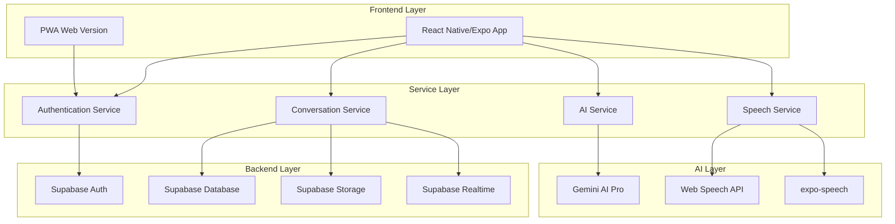

# 📖 WorldSpeakAI 開発者ドキュメント

> **革新的な多言語AI会話学習プラットフォームの完全開発ガイド**

[](https://github.com/hayate-business/WorldSpeakAI/pulls)
[](https://opensource.org/licenses/MIT)
[](https://typescriptlang.org/)
[](https://reactnative.dev/)
[](https://supabase.com/)

## 🎯 プロダクト概要

WorldSpeakAIは、**実際の発話時間のみカウントする革新的なマイク時間管理**と**初心者向け台本ガイダンス機能**を特徴とする、次世代多言語AI会話学習プラットフォームです。

### 🔥 コア特徴
- **🎤 公平なマイク時間制限**: 無音時間を除外し、実際に話した時間のみカウント
- **📜 革新的台本機能**: 初心者でも安心の会話ガイダンスシステム
- **🌍 100+言語対応**: Gemini AI Pro統合による自然な多言語会話
- **🎯 専門分野特化**: ビジネス、医療、法律、技術分野の専門会話
- **📊 詳細学習分析**: AI駆動の個別学習進捗トラッキング

## 📚 開発者向けドキュメント体系

```mermaid
graph LR
    A[📋 Overview] --> B[🏗️ Architecture]
    B --> C[🖼️ Screens]
    C --> D[⚙️ Features]
    D --> E[🗄️ Database]
    E --> F[📡 API]
    F --> G[🔧 Setup]
    G --> H[🚀 Deployment]
    H --> I[🔍 Troubleshooting]
    I --> J[🛣️ Roadmap]
    
    style A fill:#e1f5fe
    style B fill:#f3e5f5
    style C fill:#e8f5e8
    style D fill:#fff3e0
    style E fill:#fce4ec
```



### 📋 [01. プロジェクト概要](./01-overview.md)
**プロダクトの全体像とビジョン**
- 🎯 プロダクトミッション・ビジョン
- 👥 ターゲットユーザー分析（初心者〜上級者）
- 💰 ビジネスモデル（Freemium → Premium）
- 🌟 競合差別化要因（台本機能・公平課金）

### 🏗️ [02. システム・アーキテクチャ](./02-architecture.md)
**技術基盤の詳細設計**
- 🛠️ 技術スタック（React Native/Expo + Supabase + Gemini AI）
- 🏛️ システム構成図（フロントエンド・バックエンド・AI統合）
- 📁 プロジェクト構造（コンポーネント・サービス・ユーティリティ）
- 🔄 データフローアーキテクチャ
- 🚀 パフォーマンス最適化戦略

### 🖼️ [03. 画面・UI仕様](./03-screens.md)
**ユーザーインターフェース完全ガイド**
- 🗺️ 画面遷移フロー（認証→学習→分析）
- 🎨 各画面の詳細仕様（レイアウト・コンポーネント）
- 📱 レスポンシブデザイン対応
- ♿ アクセシビリティ配慮
- 🌐 多言語UI対応

### ⚙️ [04. 機能仕様書](./04-features.md)
**機能の詳細実装ガイド**
- 🔐 **認証・セキュリティ**: MFA対応Supabase Auth
- 🤖 **多言語AI会話**: Gemini AI Pro統合
- 🎤 **革新的マイク管理**: 実発話時間トラッキング
- 👤 **高度プロフィール管理**: 多言語学習進捗
- 💳 **サブスクリプション**: 段階的プラン管理

### 🗄️ [05. データベース設計](./05-database.md)
**Supabase PostgreSQL完全設計**
- 📊 ER図・テーブル構造（profiles, conversations, messages等）
- 🔒 RLS（Row Level Security）ポリシー
- ⚡ インデックス・パフォーマンス最適化
- 🔄 トリガー・ファンクション（自動処理）
- 📈 分析・レポート用マテリアライズドビュー

### 📡 [06. API仕様書](./06-api.md)
**統合API完全リファレンス**
- 🏠 **Supabase API**: 認証・データベース・ストレージ・リアルタイム
- 🧠 **Gemini AI API**: 多言語会話生成・台本作成
- 🎙️ **Web Speech API**: 音声認識・合成（100+言語）
- 📊 **レート制限・エラーハンドリング**: 本番運用対応

### 🔧 [07. セットアップガイド](./07-setup.md)
**5分で始める開発環境構築**
- ⚡ **クイックスタート**: 最小限セットアップ（5分）
- 🔧 **詳細セットアップ**: 完全開発環境構築
- 🌍 **環境別設定**: 開発・ステージング・本番
- 🧪 **テスト環境**: Jest・E2E・音声機能テスト
- 📱 **マルチプラットフォーム**: iOS・Android・Web対応

### 🚀 [08. デプロイメント](./08-deployment.md)
**本番環境への展開戦略**
- 🌐 **Web展開**: Vercel・Netlify・PWA最適化
- 📱 **モバイル**: EAS Build・App Store・Google Play
- 🐳 **コンテナ**: Docker・Kubernetes・CI/CD
- 🔒 **セキュリティ**: 暗号化・CSP・監査ログ
- 📊 **モニタリング**: Sentry・Analytics・パフォーマンス

### 🔍 [09. トラブルシューティング](./09-troubleshooting.md)
**問題解決・診断ツール**
- 🚨 **緊急対応フローチャート**: 問題の迅速な特定
- 🛠️ **環境・セットアップ問題**: Node.js・Metro・環境変数
- 🔐 **認証・セキュリティ**: Supabase・RLS・セッション管理
- 🎤 **音声機能**: Web Speech API・expo-speech・権限問題
- 🤖 **AI・API**: Gemini API・レート制限・パフォーマンス
- 🧪 **自動診断ツール**: 包括的ヘルスチェックシステム

### 🛣️ [10. 開発ロードマップ](./10-roadmap.md)
**長期戦略・技術革新計画**
- 🎯 **2025 Q1-Q4**: 発音評価・専門分野・AIコーチング・ソーシャル
- 🏢 **2026**: エンタープライズ・教育機関向けソリューション
- 🚀 **2027+**: VR/AR・脳科学・量子AI統合
- 📈 **ビジネス成長**: 市場展開・収益モデル・KPI
- 🤝 **戦略的パートナーシップ**: 技術・教育・業界連携

## 🚀 クイックスタート（5分セットアップ）

### 前提条件
- **Node.js**: v18.0.0+ (推奨: v20.x LTS)
- **npm**: v9.0.0+
- **Git**: v2.30.0+

### 1. プロジェクトセットアップ
```bash
# 1. リポジトリクローン
git clone https://github.com/hayate-business/WorldSpeakAI.git
cd WorldSpeakAI

# 2. 依存関係インストール
npm install

# 3. 環境変数設定
cp .env.example .env.local
# .env.localを編集（Supabase URL, Gemini API Keyを設定）

# 4. 開発サーバー起動
npm start
```

### 2. 必要なAPIキー設定
```bash
# .env.local に以下を設定
EXPO_PUBLIC_SUPABASE_URL=https://your-project.supabase.co
EXPO_PUBLIC_SUPABASE_ANON_KEY=your-anon-key
GEMINI_API_KEY=your-gemini-api-key
```

### 3. 開発コマンド
```bash
# Web開発サーバー
npm run web

# モバイル開発（要Expo Go）
npm run android  # Android
npm run ios      # iOS (macOSのみ)

# 型チェック・リント
npm run type-check
npm run lint

# テスト実行
npm test
npm run test:coverage
```

## 🛠️ 開発ワークフロー

### ブランチ戦略
```bash
main          # 本番リリース用
develop       # 開発統合ブランチ
feature/*     # 機能開発ブランチ
hotfix/*      # 緊急修正ブランチ
```

### コミット規約
```bash
feat: 新機能追加
fix: バグ修正
docs: ドキュメント更新
style: コードスタイル修正
refactor: リファクタリング
test: テスト追加・修正
chore: ビルドツール・設定変更
```

### PR（プルリクエスト）手順
1. **feature ブランチ作成**: `git checkout -b feature/your-feature-name`
2. **実装・テスト**: 機能実装と包括的テスト
3. **コードレビュー**: TypeScript型チェック・ESLint・テスト通過
4. **PR作成**: 詳細な説明とテスト手順を記載
5. **マージ**: レビュー完了後developにマージ

## 🏗️ アーキテクチャ概要



## 🎯 開発優先度

### 🔥 高優先度（Phase 1 完了済み）
- ✅ 多言語AI会話エンジン
- ✅ 革新的台本ガイダンス
- ✅ 公平マイク時間管理
- ✅ クロスプラットフォーム対応

### 🚧 中優先度（Phase 2 進行中）
- 🔄 発音分析・評価システム
- 🔄 専門分野特化（ビジネス・医療・法律）
- 🔄 AIコーチング機能
- 🔄 詳細学習分析

### 📅 低優先度（Phase 3+ 計画中）
- 📋 ソーシャル学習機能
- 📋 VR/AR統合
- 📋 エンタープライズ向け機能
- 📋 量子AI統合

## 🤝 貢献ガイド

### Issue報告
- **バグ報告**: [Bug Report Template](.github/ISSUE_TEMPLATE/bug_report.md)
- **機能要望**: [Feature Request Template](.github/ISSUE_TEMPLATE/feature_request.md)
- **改善提案**: [Enhancement Template](.github/ISSUE_TEMPLATE/enhancement.md)

### 開発参加
1. **Fork & Clone**: リポジトリをフォーク
2. **Issue確認**: 既存Issueから選択または新規作成
3. **ブランチ作成**: `feature/issue-number-description`
4. **実装・テスト**: 包括的なテスト実装
5. **PR作成**: レビュー用の詳細な説明

### コードスタイル
- **TypeScript**: 厳密な型チェック
- **ESLint**: Airbnb設定ベース
- **Prettier**: 自動フォーマット
- **コメント**: TSDoc形式

## 📊 プロジェクト統計

| 指標 | 現状 | 目標（2025年末） |
|------|------|-----------------|
| **技術負債比率** | <5% | <3% |
| **テストカバレッジ** | 85% | 95% |
| **型安全性** | 98% | 100% |
| **パフォーマンス** | <2秒起動 | <1秒起動 |
| **音声認識精度** | 90% | 95% |
| **AI応答品質** | 85% | 92% |

## 🔗 関連リンク

### 開発リソース
- 📖 **TypeScript Handbook**: [typescriptlang.org](https://www.typescriptlang.org/docs/)
- ⚛️ **React Native Docs**: [reactnative.dev](https://reactnative.dev/docs/getting-started)
- 🚀 **Expo Documentation**: [docs.expo.dev](https://docs.expo.dev/)
- 🏠 **Supabase Docs**: [supabase.com/docs](https://supabase.com/docs)
- 🧠 **Gemini AI Docs**: [ai.google.dev](https://ai.google.dev/docs)

### コミュニティ
- 💬 **GitHub Discussions**: [技術的な質問・機能提案](https://github.com/hayate-business/WorldSpeakAI/discussions)
- 🐛 **Issues**: [バグ報告・改善要望](https://github.com/hayate-business/WorldSpeakAI/issues)
- 🔧 **Pull Requests**: [コード貢献](https://github.com/hayate-business/WorldSpeakAI/pulls)

## 📄 ライセンス

このプロジェクトは [MIT License](LICENSE) の下で公開されています。

## 🙏 謝辞

WorldSpeakAIは以下の優秀なオープンソースプロジェクトとサービスの上に構築されています：

- **React Native/Expo**: クロスプラットフォーム開発フレームワーク
- **Supabase**: オープンソース Firebase 代替
- **Google Gemini AI**: 次世代大規模言語モデル
- **TypeScript**: 型安全なJavaScript拡張

## 📞 サポート

### 開発者サポート
- 📚 **ドキュメント**: このREADMEと各種仕様書
- 💬 **GitHub Discussions**: 技術的な質問
- 🐛 **Issues**: バグ報告・機能要望
- 📧 **開発チーム**: 緊急時のみ

### ユーザーサポート
- 🌐 **公式サイト**: [worldspeakai.com](https://worldspeakai.com)（今後開設予定）
- 📱 **アプリ内ヘルプ**: ヘルプ・サポート機能
- 🔧 **トラブルシューティング**: [詳細ガイド](./09-troubleshooting.md)

---

**🌟 WorldSpeakAIと共に、言語学習の未来を革新しましょう！**

*最終更新: 2025年1月5日*